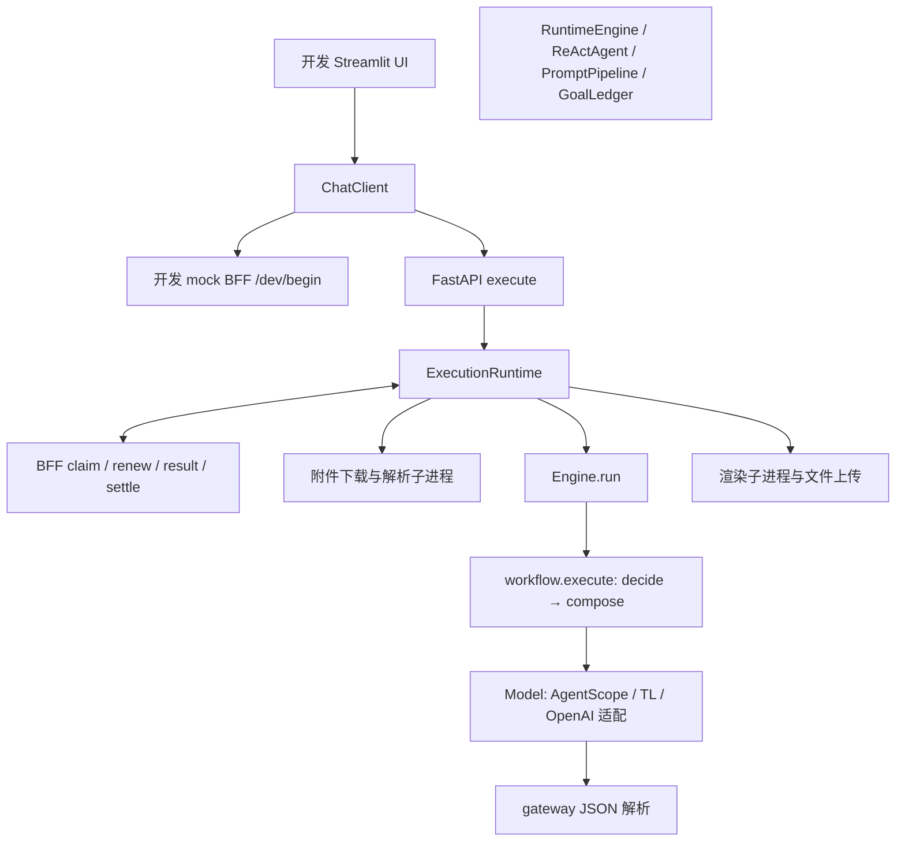

# GenSlide 架构与代码走查

审查日期：2026-09-29。基线：`193de774`，审查开始时工作区干净。本次只新增报告，不修改业务代码。

## 结论

作为请求驱动的创作执行服务，分层方向合理：BFF 掌握身份、会话版本和提交权，执行服务负责一次授权操作，模型适配与解析/渲染相互隔离。但当前代码尚不能支持文档中“已集成的通用长程助手”这一定位。新内核主要是独立组件，实际生产入口仍运行两次模型调用的创作流程。

建议保留现有执行边界，先修复当前主链路的问题，再用明确的执行器接口接入新内核。不要为了统一命名，直接以新 RuntimeEngine 替换已有 ExecutionRuntime：后者已经承载较完整的租约、提交对账和重复取消保护。

## 实际调用关系



图中独立的 N 节点尚无默认 API 请求链路调用。生产目标是由真实 BFF 接受用户请求并转发执行；本仓库未提供生产 BFF、数据库实现或持久任务调度器。

## 已确认问题：当前请求链路

### 1. [P1] JSON 清洗修改合法正文，甚至使合法响应解析失败

- 位置：`backend/genslide_agentscope/gateway/repair.py:164`；`gateway/sanitizer.py:34`、`:51`；`model.py:27`。
- 原因：先对原始 JSON 全文执行正则清洗，再尝试 JSON 解析。围栏匹配使用 `search`，没有限定为包裹整个响应的外围代码块；`<think>` 清理也不区分 JSON 字符串内外。
- 复现：对 `json.dumps({'effect':'reply','reply':'示例：```python\nprint(1)\n```'})` 调用 `loads_repaired`，当前环境返回空字符串；随后 `decode_output` 会以 `MODEL_OUTPUT_INVALID` 拒绝。合法正文 `请原样保留 <think>示例文本</think> 标签` 被改成 `请原样保留  标签`。
- 影响：创作代码示例、技术文档、讨论标签语法时，可能额外重试、失败，或者静默丢失内容。已进入生产模型边界。
- 建议：原文首先严格解析；只有失败后才剥离明确位于 JSON 外部的 envelope。确保合法 JSON 中字符串值逐字保留；把词法修复与内容改写分开。
- 验收：正文含围栏、标签、转义引号时 `decode_output(json.dumps(value)) == value`；外部 reasoning/fence 包裹仍可解析。

### 2. [P1] 自然语言多轮确认缺少上一轮问题和选项

- 位置：`backend/genslide_agentscope/workflow.py:146`、`:163`、`:201`；`domain.py:134`、`:168`。
- 原因：请求只带当前 message，快照只带 requirements、outline、content 和 Skill 元数据，既不保留先前回复，也不保留待答问题/候选项。每次模型调用创建新 Agent，无法靠其内部历史补足。
- 复现：第一轮回复包含 A/B 选项；经 `snapshot_from_memory → memory_from_snapshot` 后，第二轮“选第二个”的 decide/compose payload 均没有前一轮回复。离线探针已确认信息缺失；未声称真实模型必然输出某一种错误答案。
- 影响：澄清问题、“按你刚才的建议”“第二种方案”等常用对话无法可靠承接。`requirement_updates` 又要求值出现在当前消息中，单纯接受旧选项也无法保存其原始值。
- 建议：由 BFF 快照携带有界的对话续接状态，如待答问题、候选项及稳定 ID、必要的最近回复摘要。用户选择应映射到已有候选项，而不是要求模型重新猜测；不必保存所有原始附件和无限聊天历史。
- 验收：在另一执行实例恢复快照后，“选第二个”仍能指向原选项；未经选择的候选项不得变成确认需求。

### 3. [P2] 可接收的正文/附件远大于可发送的模型上下文

- 位置：`backend/genslide_agentscope/workflow.py:205`；`model.py:10`、`:17`；`config.py` 的 `max_material_chars` / `max_snapshot_bytes`。
- 原因：compose 总是携带材料全文；局部修改也携带整个 current_content。模型 payload 上限是 60,000 字节，而材料允许 100,000 字符，快照允许 2 MiB。没有对齐预算或分块。系统提示词和 Skill 本身还未计入这个 payload 上限。
- 复现：合法 Content 包含 3 章，每章 8,000 个中文字，只改其中一章仍在 compose 时报 `MODEL_CONTEXT_TOO_LARGE / 413`。21,000 个中文字的材料也同样失败；两个场景 decide 均已成功。
- 影响：已生成/恢复的长稿可能无法继续修改，用户在附件合法且解析成功后才收到错误。
- 建议：先做完整请求预算；局部修改只发送目标章节和必要摘要；长材料采用有界摘录或分块事实提取；长稿生成恢复批次策略。不能只提高附件或快照上限。
- 验收：上述两个用例能完成分块处理，或在模型调用前给出清楚一致的容量拒绝；未修改章节逐字保持。

### 4. [P2] 开发 UI 在终态失败后没有继续对话的出口

- 位置：`frontend/assistant_demo.py:34`、`:38`、`:53`、`:55`；`frontend/service_chat_client.py:64`；`backend/genslide_agentscope/mock_bff.py:130`。
- 原因：只有成功才清除 pending，所有异常都保留 pending 并禁用输入框；客户端对 begin 返回的 closed 状态仍继续 execute。
- 触发：输入不存在的 Skill 导致 422，执行层结算 action 为 closed；重试相同 action 得到 `ACTION_CLOSED`，UI 仍只允许继续重试。修改页面中的 Skill 也不会更新已保存的 pending 参数。
- 影响：一次不可恢复失败就使当前页面会话无法提交新输入，需要重置页面状态。范围为开发 UI；这是静态控制流证据，本次未做浏览器交互复现。
- 建议：区分“结果未知/仍执行中”和“已确认终态失败”。前者对账并保留 action，后者展示错误并允许编辑后创建新 action；不要无条件更换未知结果的 action，以免重复执行。

## 新内核问题：接入前需要解决

以下缺陷目前不影响默认 API 创作请求，因为新内核尚未接入；直接使用导出的组件或未来接入时可触发。

### 5. [P2] DoomLoopGate 把不同工具参数误判为同一动作

- 位置：`backend/genslide_agentscope/planning/gates.py:57`；`runtime/react_agent.py:166`、`:182`。
- 原因：历史保存 `action_input`，哈希却读取顶层 `parameters`，因此参数始终为 None。三个不同工具调用都只有相同的 `action=call_tool` 被纳入判断。
- 复现：工具参数依次为 `{'n':0}`、`{'n':1}`、`{'n':2}`，尚未返回计划中的 final_reply 就得到 `doom_loop`，iterations=3。
- 建议：统一 ReActStep/StopGate 的类型契约，指纹包含工具名和规范化参数；明确“重复失败”是否还需结合执行结果。回归应使用真实 ReActStep 导出的历史格式。

### 6. [P2] execute_turn 的 max_turns 参数没有生效

- 位置：`backend/genslide_agentscope/runtime/react_agent.py:66`、`:80`。
- 复现：传 `max_turns=1`，假模型先 call_tool 后 final_reply，结果 iterations=2。默认 CompositeGate 仍有自己的 20 轮上限，因此默认情况不是无限循环；替换 gate 时则可能失去这一保护。
- 建议：把调用级上限作为不可被可选门控移除的硬限制，或者删除这一无效参数并提供唯一明确的预算入口。明确收尾轮是否计入预算。

### 7. [P2] 新运行时在重复取消下会中断清理

- 位置：`backend/genslide_agentscope/runtime/engine.py:20`；对照 `execution.py:97` 的 `_finish_cleanup`。
- 原因：第一次取消后改为无 shield 的 `await task`，第二次取消会传播到 cleanup task。
- 复现：清理协程等待事件时连续取消包装任务两次，随后释放事件，清理完成标志仍为 False。
- 建议：复用现有执行层反复 shield 并 join 的语义，抽取一个共享工具；清理结束后再传播取消，不提前释放资源所有权。
- 验收：连续多次取消下，清理完成、子任务终止和资源释放必须先于父任务退出。

### 8. [P2] FINALLY 中一个 Hook 失败会跳过后续清理 Hook

- 位置：`backend/genslide_agentscope/runtime/hooks.py:142`；`runtime/engine.py:100`。
- 原因：run_phase 中一个 hook 抛异常就退出循环，外层仅记录并吞掉异常。后续清理 hook 不会执行；SHORT_CIRCUIT 也会提前退出这一阶段。
- 触发：先执行的清理 hook 失败，后续负责释放工作区或槽位的 hook 被跳过。静态控制流确认，本次未为该项新增运行探针。
- 建议：FINALLY 采用独立的清理执行策略，逐项尽力执行并收集错误；普通业务阶段仍可保留 fail-fast 和 short-circuit。明确清理次序与资源依赖。

## 架构判断与演进边界

### 应保留的设计

1. BFF 作为身份、版本、生命周期和提交权威；执行服务不直接连接业务数据库。claim 的快照恢复不依赖本地内存命中。
2. 执行实例绑定、租约续期、提交丢回执后的 settle 对账，减少错误重跑和结果不确定性。
3. 解析/渲染放入可终止子进程，限制附件大小、输出规模、并发和工作区；这比在 API 协程中执行文档 CPU 工作更稳妥。
4. Skill 在首个 await 前做快照，并绑定版本/hash；请求中途 reload 不会混用规则。
5. 前后端依赖环境分离、契约 schema 一致性校验，以及已有取消/提交边界测试。

### 最主要的架构落差

`docs/architecture/current-system.md:8` 描述请求已经过提示词流水线、8 阶段内核及长程门控；实际 `engine.py:29` 直接进入 `workflow.execute`。`RuntimeEngine`、`ReActAgent`、PromptPipeline 的引用主要来自模块内部、导出与测试；模型能力缓存也只有导入而未进入调用策略。

因此应把“组件实现”“默认链路接入”“持久长任务能力”作为三个独立完成标准。现在默认流程仍受单次 HTTP 连接、action deadline 和进程生命周期约束；GoalLedger 也不在 ExecutionSnapshot 中。它具备请求级执行基础，但还没有可在进程重启后续跑的持久任务闭环。

建议明确四层职责：

| 层 | 建议职责 | 不应承担 |
| --- | --- | --- |
| BFF / 持久任务控制 | 身份、版本、任务状态、幂等、授权与恢复 | 模型推理细节 |
| ExecutionRuntime | claim/lease/deadline/cancel/settle、资源生命周期 | 创作策略与通用规划规则 |
| Executor | 创作 workflow 或 ReAct；输出统一、可验证的结果 | 绕过 BFF 提交、另起一套授权 |
| Model / 工具适配 | 协议、预算、结构化输出校验、受控工具调用 | 根据提示词文本授予权限 |

8 阶段 hook 层适合成为 ExecutionRuntime 内部受约束的扩展机制；不要让 hook 和外层各自拥有 claim、commit、cleanup 的最终决定权。工具开启后，权限与参数约束必须由实际 dispatcher 强制执行，P100 文本排序本身不能形成安全边界。

### 次要维护风险

- `execution.py` 超过千行，混合 CPU worker、准入、租约、事件和提交对账。可按上述职责拆分，但应优先保留现有取消测试和行为不变量。
- `Engine.run` Protocol 未声明实际调用的 `progress` 关键字；符合 Protocol 的替代实现仍可能在运行时报 TypeError。建议统一接口并做类型检查。
- `Engine.committed` 缓存保存完整正文，但请求恢复实际读取 BFF snapshot，不调用 `Engine.read`；会话容量限制因此可能拒绝仍可通过 BFF 恢复的新会话。建议明确缓存价值，若保留则使用可淘汰缓存而非权威容量门槛。
- `generate_sections`、MATERIAL_BRIEF_PROMPT 等能力未被当前 workflow 使用；旧配置如 planning 并发/超时与统一 generation 准入也需核对是否仍是有效配置。
- 宽泛异常捕获有些服务于边界脱敏，有些会隐藏根因。对外保持安全错误码，对内应补充不含正文/凭据的 action/instance 关联日志。
- TL proxy 本次仅做源码抽查；默认 debug 日志和 local 认证是开发配置，仓库文档已有边界说明。本次未把该工具视为生产网关。

## 建议修复顺序

1. 修复 JSON 清洗；加入合法 JSON 保真回归。
2. 补齐跨轮续接状态和上下文预算，同时处理 UI 的已确认失败状态。
3. 修复新内核门控与清理语义；统一类型契约，避免单元测试使用与真实运行不同的手写历史结构。
4. 以一个真实 API 集成用例连接 ExecutionRuntime 与新执行器，再更新文档中的完成状态。
5. 若目标确实是长程云端助手，再设计持久任务记录、checkpoint、重启恢复和工具副作用幂等；不要仅凭多轮 while 循环宣称已支持长程恢复。

## 验证记录与限制

- 前端：仓库根 `.venv/bin/python -m pytest -q frontend/tests`，46 passed，2 条 protobuf 弃用警告。
- 后端：backend 目录 `.venv/bin/python -m pytest -q`，174 passed。
- `uv run --locked` 两次尝试均因沙箱无法读取用户 uv 缓存退出；改用已安装虚拟环境完成测试，没有安装依赖或改锁文件。因此未重新验证 locked 环境同步。
- 离线回归探针：`backend/.venv/bin/python /tmp/genslide_regression_probes.py`，覆盖门控误判、max_turns、重复取消、两种上下文超限和跨轮历史缺失。脚本退出成功表示缺陷复现成功，不表示行为正确。脚本仅在临时目录。
- 主代理另用当前环境直接验证 gateway 对合法 JSON 字符串的破坏。
- 未调用真实模型；未验证生产 BFF/TDSQL、Kubernetes 故障切换或浏览器交互；未运行 TL proxy 测试。本次重点是默认请求链路和新增内核，legacy 目录没有逐行审计。
- 现有 220 项测试通过与上述缺陷并不矛盾：测试缺少多轮语义续接、真实历史结构下的门控、重复取消和合法 JSON 内容保真等场景。

## Subagent execution record

1. `explorer__runtime_review`：luna_explorer / gpt-6-luna / medium，spawn；只读检查新增模块与生产引用。
2. 同一 explorer 的 followup：修正门控误判方向并检查重复取消、FINALLY。初始“重复调用逃逸”结论经主代理复核纠正为“不同调用被误判相同”，本报告采用后者。
3. `luna__test_baseline`：luna_low / gpt-6-luna / low，spawn；运行前后端基线，结果 46 + 174 passed。
4. 同一 Luna Low 的 followup：离线回归探针；追加一次 message 要求检查快照往返后的对话信息。全部完成，无仓库代码改动。

## Main-agent work

梳理实际 API、BFF、执行、模型、前端调用链；审查持久化、租约、取消、容量和部署边界；复核子代理证据及探针源码，纠正误判；直接验证 JSON 清洗缺陷；形成风险分级、架构建议与本报告。
