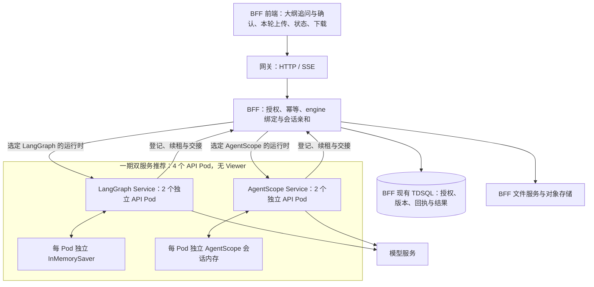
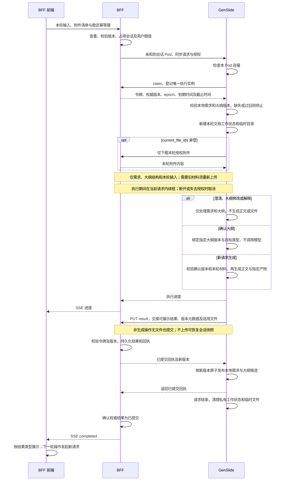
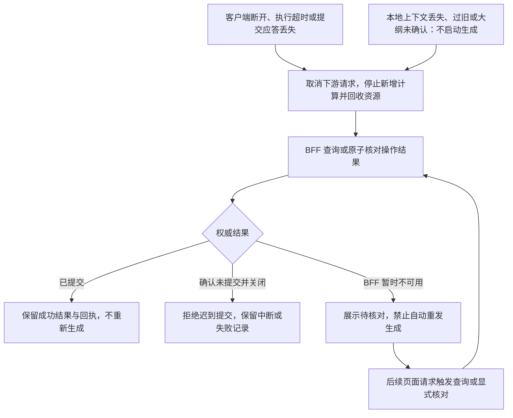
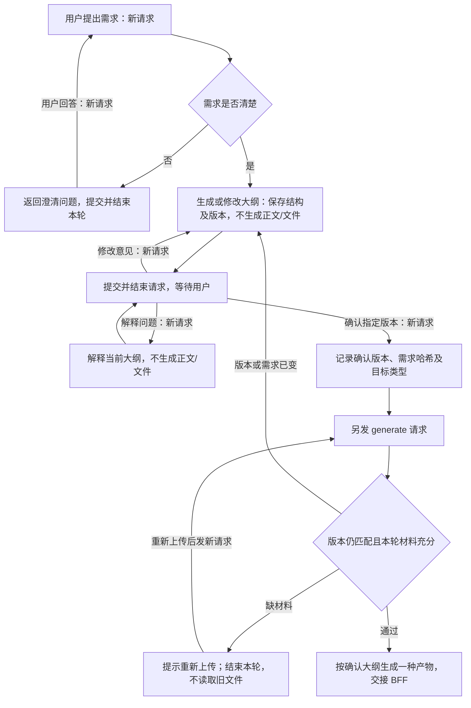

# GenSlide 双框架纯同步多用户内容平台方案与分期实施计划

> **历史归档（已取代）。** 本文描述的「LangGraph 与 AgentScope 两套独立服务并行交付」方案已不再执行：
> `services/genslide-langgraph` 及其副本一致性检查 `tools/check_service_parity.py` 已从仓库移除，
> AgentScope 是当前唯一引擎。文中涉及 LangGraph、双包对等交付、旧 Streamlit 工程的内容仅作为
> 设计历史保留，请勿据此实现。现行结构见根目录 [README](../../README.md)。

更新日期：2026-09-16

状态：一期核心代码已实现，尚未完成真实 BFF/模型联调及生产环境验证。本文仍是完整目标方案，不能把全部验收项视为已通过；实际交付与限制见 [一期实现记录](phase1-implementation-status.md)。

## 1. 目标与已确认边界

本文第一至三章以一期生产版本为默认范围；历史文档复用、修改、派生、审批联动、Streamlit Viewer 及 Redis 可重建缓存属于二期，不作为一期上线依赖。

- 一期交付两套完整独立的 API 服务包：`genslide-langgraph` 和 `genslide-agentscope`，分别基于 LangGraph 与 AgentScope，都能独立为 BFF 提供相同业务服务。不是一个工程内通过 engine 开关切换框架，也不是由一套调用另一套。两套均不提供独立业务前端，不启动旧 Streamlit 入口。
- BFF 负责用户认证、租户权限、会话版本、执行授权和租约、幂等、用户准入、交接凭据及结果/文件留存；可恢复需求/大纲快照、历史目录、审批和预览授权放到二期。
- GenSlide 一、二期均通过 BFF 接口使用权威状态能力，不直接连接 MySQL/TDSQL，不配置数据库连接、不引入 ORM、不管理表结构和迁移；对象存储仅由 BFF 文件服务访问。
- BFF 传入的身份来自可信内部链路；公网请求不能自行声明可信身份。
- GenSlide 采用请求内同步执行：HTTP/SSE 请求持有整个生成过程，不引入生成任务队列、后台 Worker、自动续跑或自动任务接管。
- 内部允许异步 I/O 和请求内并发，所有生成子任务必须归属当前请求并可取消。
- 每个用户可有多个会话；会话键为 `(tenant_id, user_id, session_id)`，不能仅使用 `session_id`。
- 一期连续对话继承用户明确提出或确认的主题、受众、语言、篇幅、风格等结构化需求、澄清状态及当前大纲结构，不继承旧文档内容或完整历史问答。
- 每个 Pod 只运行其中一套服务的一个 API 主进程，多请求并发并使用受限线程池。LangGraph 版使用原生 `thread_id` 与 `InMemorySaver`；AgentScope 版使用该框架的显式状态能力配合包内轻量内存会话适配，不能依赖 LangGraph checkpointer。两者仅保留需求、澄清与大纲，不交给 BFF 保存恢复快照，不使用 Redis；BFF 仍裁决 4 小时空闲有效期。
- 两版一期均接受内存状态的限制：需要会话亲和，进程重启丢失草稿，不提供透明恢复；只做基本过期清理和容量保护，不建设复杂状态压缩、迁移或高可用系统。该选择是项目范围取舍，不表示框架内存实现具备生产持久化保证。
- 一期采用“澄清需求 → 生成/修改大纲 → 继续追问 → 确认指定版本 → 新请求生成”的流程。确认前只返回文本和大纲结构，不生成正文或文件；等待用户时结束当前请求，不挂起 Agent 或占用执行槽。
- 一期支持随应用发布的内置 skill：以声明式流程规则和提示词指导 Agent，不执行 skill scripts、不动态加载代码、不开放用户上传或远程安装 skill。硬性流程与权限仍由服务端代码校验，详见第 3.8 节。
- 每轮只处理 `current_file_ids` 指定的本轮上传附件。空列表表示没有附件，不回退到旧附件或已生成产物；文档工作状态和临时目录每轮新建。
- 一期 GenSlide 的外部服务依赖为 BFF 和模型服务；取消的是本工程对数据库及 Redis 的直接依赖，不是整个系统的可靠持久化能力。二期 Redis 只作为可关闭的性能优化，不承担正确性保障。
- 一期支持聊天澄清、写作、WPS/Word 可编辑的 DOCX、PPTX 生成。同一会话可以留存多份独立结果，但一次操作只生成用户指定的一种产物，不提供历史产物版本修改或派生。
- **写作是一期上线必交付能力，不是二期功能或可选增强。LangGraph 与 AgentScope 两版都必须完成写作闭环；仅 PPT 可用不能视为一期完成。** P0–P8 是一期内部开发步骤，P6 不表示二期。
- 只要求文档时不生成 PPT；生成 DOCX 所需的中间内容不自动成为另一份写作产物。
- 前端业务交互和结果展示、下载由 BFF 实现。生成文件、结构化产物和回执仍交给 BFF；保存供展示和下载，不等于允许下一轮自动使用。
- 二期再新增独立、只读、可嵌入 iframe 的 Streamlit Viewer；不承诺 DOCX 的真实分页、页眉页脚或 PPTX 的真实页面排版，不提供在线编辑。

数据库结论：本工程可以完全没有 MySQL/TDSQL 直接依赖，二期也不必引回；BFF 继续使用现有权威存储，可靠交接、幂等和执行授权不能随 Redis 或历史文档功能一起取消。一期不要求 BFF 保存可恢复的需求/大纲快照，但接受 Pod 内存丢失后无法透明恢复草稿的限制；二期可重建缓存的前置条件见第 4.7 节。

## 2. 服务与代码边界

### 2.1 职责与分期

| 部分 | 职责 | 禁止耦合 |
| --- | --- | --- |
| BFF 前端 | 一期聊天、澄清、大纲展示/追问/版本确认、本轮上传、发起生成、SSE 和下载；二期历史产物选择、修改、审批与 iframe 联动 | 不自动补入旧文件，不把“本轮完成”误显示为“文件已生成” |
| BFF 服务 | 请求编排、身份权限、会话版本、执行授权和租约、幂等、全局用户准入、交接凭据、结果与文件留存，以及到 API 的会话亲和路由 | 一期不承担可恢复需求/大纲快照；不信任公网身份参数，不持有数据库事务等待生成 |
| GenSlide API | 单主进程维护有界会话内存中的需求和当前大纲；请求内澄清、修改大纲、本轮附件处理、生成、渲染、登记/续租/交接与资源管理 | 不自建权威状态库，不复用旧文档；不使用线程私有变量绑定用户，不承载 Viewer WebSocket |
| Redis（二期可选） | 先补齐 BFF 恢复快照，再缓存已提交需求与大纲结构，支持版本校验和条件更新；是否启用由压测决定 | 一期不接入；不保存旧文档上下文，不承担权威版本、执行锁、幂等或任务队列 |
| Streamlit Viewer（二期） | 从 BFF 读取固定产物版本，展示标题、正文、表格、内容卡片和备注 | 一期不开发上线；不执行 Agent、不访问 Redis/TDSQL/对象存储、不上传文件、不审批、不维护业务短期记忆 |
| BFF 现有 TDSQL | 由 BFF 管理权威记录、表结构、事务及迁移 | GenSlide 不直接连接，不持有数据库账号 |
| 对象存储 | 由 BFF 文件服务统一读写与留存 | GenSlide 和 Viewer 不直接访问；文件通过 BFF 的 file_id 及下载能力获取 |
| 模型适配器 | 受并发和截止时间约束的模型调用 | 不自行创建脱离请求的后台生成任务 |

### 2.2 规划代码职责

下表是两包各自拥有的逻辑模块；`genslide/` 为职责简称，实际分别位于 `genslide_langgraph/` 和 `genslide_agentscope/`，不是共享运行时包。现有入口保留用于开发与回归，一期生产只启动新 API：

| 模块 | 规划内容 |
| --- | --- |
| `genslide/api` | 统一执行入口、操作类型、大纲版本/确认参数、内部身份、`current_file_ids`、目标产物、HTTP/SSE 与错误映射 |
| `genslide/domain` | 身份/运行时、授权/回执、需求/澄清状态、`OutlineDraft` 与确认记录、请求私有文档状态及 `DocumentContent`、`PresentationContent`；不依赖存储实现 |
| `genslide/services` | 授权版本校验、需求/大纲白名单、本轮附件、确认校验及交接协调；只允许已提交状态进入下一轮，不自行裁决权威版本与审批 |
| `genslide/session_runtime` | 各包的薄适配：LangGraph 管理 thread/checkpoint 提交标记，AgentScope 管理白名单会话状态及提交修订号；两者均负责互斥、过期清理和基本容量，不共享可变对象 |
| `genslide/engine` | 各自框架专属编排、状态与事件转换；LangGraph 包不加载 AgentScope，AgentScope 包不调用 LangGraph 或复用其节点类型 |
| `genslide/workflows` | 澄清、大纲创建/修改/解释，与确认后 PPT/写作/DOCX 生成分支分离；仅生成分支可进入正文和渲染；二期再接历史修改/派生 |
| `genslide/skills` | 内置 skill 注册、元数据校验、确定性选择与分阶段提示词组装；只返回流程配置，不提供脚本执行器或动态插件加载器 |
| `genslide/skills/builtin` | 随镜像发布的只读 skill 清单与 Markdown 指令，按 PPT、写作、DOCX 组织；版本固定，不携带 scripts |
| `genslide/execution` | Pod 准入、公平调度、截止时间、取消、阶段子进程，以及请求内 claim/renew 生命周期 |
| `genslide/adapters/bff` | 执行登记、续租、结果提交、查询、授权核对、运行时元数据和文件接口；一期没有需求快照读写；统一认证、超时与安全重试 |
| `genslide/adapters/redis`（二期） | 二期才实现复合缓存键、序列化、版本条件更新、TTL、大小限制及降级；一期不实现、不装配，不提供业务锁 |
| `genslide/adapters/models` | 模型协议、流式响应、调用预算和取消适配 |
| `genslide/renderers` | 结构化内容到 Markdown、DOCX、PPTX 文件的转换 |
| `viewer`（二期） | 独立 Streamlit 入口、预览契约、BFF 只读客户端和展示组件，不阻塞一期 API 交付 |
| `tests` | 单元、契约、集成、安全、取消、故障一致性和负载测试 |
| `deploy` | 一期仅 API 的部署、网关、资源限制和非 root 配置，无 Redis 服务或连接配置；二期增加独立 Viewer 及可选缓存配置，不包含数据库迁移 |

GenSlide 不再规划 SQLAlchemy、PyMySQL、Alembic 或 `migrations` 模块。BFF 团队在其现有工程内维护权威记录及迁移；GenSlide 服务层只依赖接口，具体客户端由入口装配，测试以 BFF 模拟服务替换真实适配器。

两包一期均只连接 BFF 和模型服务，不引入 Redis 客户端、凭据或启动检查。LangGraph 检查点及 AgentScope 跨轮状态都只用于需求/大纲；正文生成与附件工具状态按请求隔离。二期先引入可靠恢复快照，再增加可关闭的缓存适配器，不能直接换成 Redis 就宣称可重建。

二期 Viewer 不导入 `frontend/ui.py`、`graph.graph` 或模型适配器，避免模块导入时启动旧页面或构造业务图。可提取现有样式与展示逻辑，但不能直接复用整个审批页面。领域内容定义不依赖 Streamlit，Viewer 只依赖版本化内容契约。

### 2.3 一期 API-only 生产部署架构



双版本同时部署时推荐 **4 个 API Pod：LangGraph 2 个 + AgentScope 2 个，0 个 Viewer**；仍在 3–5 个应用 Pod 预算内。只有 3 个 Pod 时采用主用版 2 个、另一版 1 个，接受后者单副本限制；5 个时按压测结果分成 3+2。不是两版各自再占 3–5 个 Pod。仅启用一版的环境可独立部署，不要求另一版存活。预算不含既有 BFF、数据库及模型服务。

**同一运行时绑定同一 engine，并亲和到该 engine 的同一 API Pod**。亲和发生在 BFF→API 链路，不能只对浏览器→BFF 做粘性，不能按 BFF 源 IP 分配用户；路由键使用可信复合会话身份及 epoch。P0 冻结路由标识、扩缩容和 Pod 替换策略；进程重启丢失内存时禁止静默切换到另一版继续。

亲和可能造成热点 Pod；满载返回受控忙碌，不为均衡负载把活跃会话迁到没有上下文的 Pod。Pod 数量不等于用户数，容量以压测为准。二期再评估共享状态、取消 API 亲和及 API/Viewer 副本重新分配。

### 2.4 现有工程流程与双版本迁移基线

本次参考的是现有业务操作和产物能力，不将旧 Streamlit 页面或 LangGraph 节点直接变成 AgentScope 包的运行时依赖。以下路径指本仓库现有代码，供迁移定位；两包必须建立同一组回归样例。

| 现有环节与代码 | 两版一期保留或调整 |
| --- | --- |
| `frontend/ui.py`：文本/PDF/DOCX 输入、生成、审阅、下载 | BFF 接管操作界面，API 保留对应输入和结果契约；只处理本轮授权附件 |
| `tools/input_parser.py`：材料解析 | 各包迁入自己的解析模块，保留格式能力及异常测试；澄清短消息不走材料长度校验 |
| `agents/orchestrator.py`：主题/大纲规划与反馈 | 提取需求、提示词及结构约束，分别用两框架实现；新增独立大纲修订/解释/确认入口，不自动接正文 |
| `agents/content_agent.py`：页面内容及备注 | 两版按同一内容 schema 输出，保留备注和有界质量修正；固定确认大纲，不默默重规划 |
| `tools/pptx_builder.py`：封面、内容页、结束页与 PPTX | 各包拥有自己的渲染实现及资源副本；同结构测试输入验证页序、内容、备注和可下载文件，不直接跨包 import |
| `graph/graph.py`：解析→规划→内容→PPTX→人工审阅 | LangGraph 拆分原直通图；AgentScope 按相同业务阶段编排，不包一层 HTTP 去调用旧图 |
| `graph/human_approval.py` 与 UI：生成后批准或反馈重做 | 不原样搬回一期：生成前的大纲确认属于一期；生成后历史产物修改、派生和审批仍在二期，避免推翻附件边界 |
| `llm` 模型接入与现有模型代理 | 两版对齐同一实际模型协议、参数和错误语义；分别适配框架对象，验证流式、取消与工具响应，不假设代理必然兼容某 SDK |

现有工程以 PPTX 为主，DOCX 当前是输入格式；大纲优先交互、写作和 DOCX 输出是两版均需新增的能力，不能标记为“直接复用后已完成”。参考旧行为时同时修正固定 thread_id、共享可变状态、错误占位结果和无法及时取消等问题。

### 2.5 两个独立包的规划目录

```text
GenSlide/
├── services/
│   ├── genslide-langgraph/
│   │   ├── pyproject.toml / uv.lock / Dockerfile / README.md
│   │   ├── src/genslide_langgraph/
│   │   │   ├── api/、domain/、services/、execution/
│   │   │   ├── engine/、session_runtime/、workflows/
│   │   │   ├── adapters/bff/、adapters/models/
│   │   │   ├── parsers/、renderers/、skills/builtin/、assets/
│   │   │   └── contracts/、config/
│   │   ├── tests/（含契约样例副本）
│   │   └── deploy/
│   └── genslide-agentscope/
│       ├── pyproject.toml / uv.lock / Dockerfile / README.md
│       ├── src/genslide_agentscope/
│       │   ├── api/、domain/、services/、execution/
│       │   ├── engine/、session_runtime/、workflows/
│       │   ├── adapters/bff/、adapters/models/
│       │   ├── parsers/、renderers/、skills/builtin/、assets/
│       │   └── contracts/、config/
│       ├── tests/（含契约样例副本）
│       └── deploy/
├── contracts/genslide-v1/（契约设计源、事件 schema、固定测试样例）
└── docs/architecture/（共同设计、依赖对齐表、双版本验收矩阵）
```

- 两包各自拥有 HTTP 入口、BFF 客户端、内容定义、模型适配、解析渲染、skill、资源、测试、镜像和部署配置；命名空间不同，不互相 import、不调用对方服务、不用指向对方目录的软链接。
- 根目录 `contracts/` 仅为设计/维护源，不是线上公共 Python 包。契约、技能内容、渲染资源和公共依赖约束以受版本控制的副本进入各包，记录版本和哈希；CI 比较副本，防止静默漂移。每包单独复制到空目录后仍能构建、测试和启动，不依赖根目录旧模块、根锁文件、PYTHONPATH 或另一包。
- 不建立 `genslide-common` 共享运行时包，不用一个统一工厂通过 engine 参数切换两框架。为满足整体独立要求，接受适量纯业务代码重复；修复共同缺陷时需双包同步任务及契约回归，不通过隐藏共享依赖降低维护成本。
- 只统一外部业务结构，内部状态/消息/工具对象保持各框架原生形态；不为抽象“通用 Agent 引擎”再引入一套复杂框架。

### 2.6 依赖尽量一致，但不强求完全相同

| 分类 | 两包对齐要求 |
| --- | --- |
| Python / OS | 两包声明 Python 3.11–3.12，本机已验证 3.12.12，镜像模板使用 3.12；同 openEuler 架构、基础镜像和非 root UID 仍须生产验证，不原地改变旧工程解释器 |
| HTTP / schema / 测试 | 统一采用 FastAPI、Uvicorn、Pydantic、HTTPX 和 pytest 等必要基础库；公共直接依赖尽量锁同一精确版本，各自拥有完整锁文件 |
| 内容解析与渲染 | `python-pptx`、`python-docx`、`pypdf`、Pillow/lxml 等按真实使用裁剪；同模板、字体及资源哈希，不靠混装旧依赖保持一致 |
| LangGraph 专属 | 当前固定 `langgraph==0.6.11`，原生 InMemorySaver 参与会话图；不导入旧工程图状态，完整传递依赖独立锁定 |
| AgentScope 专属 | 固定 `agentscope==2.0.7.post1`，独立版本基线位于 `backend/requirements.txt`；P0 验证该版本兼容性，不自动升至其他 2.x 版本。不照搬 1.x 示例，不引入 LangGraph 来模拟其会话 |
| 不纳入一期 | 两包均不主动引入 SQL/ORM/迁移、Redis、旧 Streamlit/Flask 业务入口、gpt4all 本地模型、完整 Runtime/Studio、脚本 sandbox 或无关全量 extras |

当前根 `pyproject.toml` 混合了旧 UI、模型及生成依赖，不能直接复制为两包全部依赖。先验证公共依赖交集，再各自解析锁定；框架传递依赖冲突时允许有据可查的差异，不使用忽略依赖检查或强压不兼容版本。安装框架可能带入未使用的传递包，应在依赖清单中说明；“无数据库依赖”首先指不要求数据库服务、凭据或启动连接，不虚称所有传递依赖完全相同。

AgentScope 固定为 `2.0.7.post1`，该发行包要求 Python 3.11+；不得用其他版本文档代替所选版本的 API 验证。[AgentScope 2.0.7.post1 发行说明与元数据](https://pypi.org/project/agentscope/2.0.7.post1/)。当前两包均已具有独立 pyproject、uv.lock 和运行入口；已验证指定 SDK、模拟模型及 TL 协议适配和取消。真实目标模型兼容性、内容质量及生产平台仍须验证；遇到不兼容先记录并评审，不能静默改版本。

### 2.7 两套服务面向 BFF 的一致契约

- 两套独立 service 地址暴露相同 `POST /v1/actions/{action_id}/execute`、健康/就绪入口以及相同请求/响应 schema；六类 operation、身份、版本、附件、结果、错误码及取消语义一致。状态查询和 settle 仍以 BFF 权威接口为准，不在服务中增加后台任务查询库。
- SSE 统一为 `accepted`、`progress`、`completed`、`error`，至少关联 `action_id`、单请求递增序号和稳定业务阶段；只发送已授权展示的进度/结果，不原样转发框架对象、推理过程或工具敏感参数。`completed` 仍只能在 BFF 完整提交后发送。
- BFF 创建运行时时确定 `engine=langgraph|agentscope`，写入授权和操作记录；目标服务校验 engine 与自身一致。engine 用于路由，不是额外的幂等空间：同一客户端操作不能分别在两版获得执行资格，同用户 AI 上限 2 是两套服务合计值。
- 路由顺序为“选定 engine → 该 service 内会话亲和”。错投返回 `ENGINE_MISMATCH`，没有本地上下文按原规则返回 `CONTEXT_LOST`；不可因一版繁忙、断连或超时就自动将同一操作发往另一版。
- 显式切换引擎须先核对/结束旧操作，再由用户确认创建新 runtime_epoch、重建需求和大纲并重新确认；一期不转换或复制 LangGraph 检查点与 AgentScope 状态。旧文件留存在 BFF，不成为新运行时输入。
- 两版接受相同模型配置、skill 内容版本和业务测试样例；返回服务实现/版本信息用于排障，但 BFF 前端不依赖框架专有事件。灰度只对新运行时分流，不在每轮随机 A/B。

## 3. 运行时会话与同步执行

### 3.1 BFF 权威状态与版本

以下四类状态统一由 BFF 原子裁决，GenSlide 不在本地内存或二期可选缓存中维护第二套权威记录：

| 能力 | BFF 负责的含义 |
| --- | --- |
| 会话版本 | 校验本轮读取的基础状态是否仍有效；成功提交时推进版本，拒绝旧版本覆盖 |
| 执行授权与租约 | 确保同会话只有一个有效写操作；唯一执行实例、令牌及截止时间阻止失效执行迟到提交 |
| 幂等 | 将稳定客户端幂等键映射为同一 `action_id`；重复请求返回原状态/结果，不再次启动模型 |
| 交接凭据 | 证明本轮结果及适用的文件引用已由 BFF 完整留存；应答丢失时可查询同一回执，不承诺恢复 GenSlide 内存 |

- `runtime_epoch` 区分同一 BFF 会话的不同运行时生命周期，阻止过期前的旧请求写入新状态。
- `session_version` 是 BFF 每次成功操作推进的权威会话版本；`outline_version` 是当前草稿内容修订号；`artifact_version` 是生成产物版本，三者不能混用。
- `action_id` 由 BFF 生成并保存，作为用户操作的幂等标识；`request_id` 仅用于网络调用追踪。
- 同一会话一次只能有一个有效写操作，包括会改变需求记忆的聊天；不同会话可并发。
- 一期每次生成交付独立结果，不根据旧产物 ID 修改或派生；保留产物标识和版本元数据供 BFF 留存，不代表开放历史文档使用能力。
- 二期才增加指定源版本修改、派生及审批联动，详见第 4 章；不会因此改变 BFF 的权威状态职责。

物理表结构、条件提交及数据库兼容性验证归 BFF 现有工程；两版只认接口契约。各自使用框架状态能力，但不直接复用旧入口包含解析正文、幻灯片和路径的完整 AgentState，也不沿用固定初始 thread_id。本地互斥保护状态读取、执行及提交标记，不代替 BFF 跨两套服务的集群级授权与租约。

### 3.2 BFF 执行编排与内部接口

BFF 公共入口接收稳定的客户端幂等键，并映射到 BFF 生成的 `action_id`；网络重试不能重新创建操作 ID。同一幂等键必须绑定相同身份、会话和操作参数，不得用于提交不同内容。

BFF 内部 `begin_execution` 一次完成身份、会话生命周期及预期版本校验，操作查重、会话占用和用户并发额度检查，并返回已有状态或创建本轮执行授权，确定 `runtime_epoch`、基础版本、授权信息和总截止时间。这是 BFF 内部编排能力，不另设 GenSlide 直连数据库入口。上述原子步骤使用短事务，不能持有数据库事务等待 GenSlide 生成结束。

BFF 对 GenSlide 的内部接口统一使用 `/internal/genslide/v1` 前缀，以下路由均相对此前缀：

| 接口 | 调用方 | 必须保证的行为 |
| --- | --- | --- |
| `POST /actions/{action_id}/claim` | GenSlide | 绑定唯一执行实例，返回执行令牌、权威版本、epoch、业务到期时间、是否尚未初始化的运行时及执行截止时间；重复转发到其他 Pod 不得再次启动模型 |
| `POST /actions/{action_id}/renew` | GenSlide | 校验执行令牌并续租，不超过总截止时间；已关闭操作不能复活 |
| `PUT /actions/{action_id}/result` | GenSlide | 校验令牌和基础版本，幂等完整保存本轮可展示结果、操作类型、大纲标识/版本/确认元数据、适用的文件引用和回执；返回新会话版本与到期时间。无文件操作也提交；一期不要求保存可恢复需求/大纲状态 |
| `GET /actions/{action_id}` | GenSlide 或 BFF 查询入口 | 返回权威操作状态和已提交结果引用；只读查询不撤销健康执行 |
| `POST /actions/{action_id}/settle` | BFF 编排层或授权核对入口 | 原子返回已提交结果，或关闭符合取消条件的未提交操作并阻止迟到提交；校验核对原因和调用权限 |
| `GET /sessions/{session_id}/runtime` | GenSlide | 可选的生命周期核对，返回身份、epoch、权威版本及到期元数据；一期不返回需求快照，也不是每请求必经步骤，正常路径使用 claim 的一致授权元数据 |

执行请求与结果至少关联 `tenant_id`、`user_id`、`session_id`、`runtime_epoch`、`action_id`、`execution_token`、`expected_session_version`。统一执行请求另含本轮用户输入、目标操作/产物类型及显式的 `current_file_ids`；不得接受历史产物 ID 作为一期的隐式修改目标。二期修改已有产物时才增加 `artifact_id`、`expected_artifact_version` 等目标选择语义。`claim` 之前携带 BFF 的初始授权，成功后取得绑定唯一 `execution_instance_id` 的执行令牌；内部接口必须使用服务认证，不能仅凭裸 ID 授权。令牌不传给前端或写入日志。

双版本额外携带 `api_contract_version`、BFF 绑定的 `engine` 和服务实现版本；claim 及令牌校验绑定 engine 和唯一实例。服务端实现标识来自部署配置，不能信任用户自行声明的 engine；重试不得改 engine 来绕过同一 action 的唯一执行约束。

- 同一会话只有一个有效写操作；集群级单用户活动 AI 请求上限为 2，均由 BFF 保证。GenSlide 只控制本 Pod 容量。
- GenSlide 先检查并占用本 Pod 容量，再 `claim`；执行登记成功后才能调用模型。重复 HTTP 转发或 `claim` 重试只能确认原执行，不得启动第二个执行循环。
- 已执行过的操作不能因 HTTP 重试再次运行，租约失效后也不自动交给另一 Pod 续跑。需要重新生成时，由用户明确发起新操作。
- 请求内每 10 秒调用 BFF 续租，默认租约窗口 45 秒；生成总截止时间为 30 分钟，澄清/大纲为 180 秒。续租不是脱离请求的后台任务。
- 续租无法确认时停止新增计算并进入取消/核对路径；最终提交仍必须通过 BFF 的令牌、租约和版本校验。续租不能超过总截止时间，也不能让已关闭操作复活。
- 普通查询不撤销健康执行；取消、超时和失效执行核对分别校验其原因。Pod 准入失败或下游调用未成功建立时，由 BFF 关闭符合条件的未提交操作并释放会话及用户额度，不遗留无限占用。
- BFF 等待 GenSlide 的同步响应时，必须仍能并发处理登记、续租、查询和交接调用；为控制接口预留容量，避免等待自身回调造成阻塞或死锁。
- 文件上传/获取沿用 BFF 文件服务：按完整身份、会话及本轮授权附件清单校验 `file_id`，由 BFF 提供下载能力，GenSlide 不持有对象存储凭证。具体文件路由及大小、哈希、超时契约在 P0 与现有 BFF 对齐。

### 3.3 Pod 会话内存、请求私有状态与 4 小时有效期

一期的连续对话是“需求和大纲连续、文档材料每轮独立”，不是保留完整历史问答。每个会话只保留一个当前草稿；开始另一个主题或目标类型时需显式创建新草稿，不暗中替换正在确认的草稿。

| 状态 | 允许内容 | 生命周期 |
| --- | --- | --- |
| 结构化需求/澄清状态 | 用户明确提出或确认的主题、受众、语言、篇幅、风格、约束，以及不含文档事实的待澄清问题和答案 | API 主进程会话内存，受 BFF 4 小时空闲期限约束 |
| 当前大纲草稿 | `draft_id`、`outline_version`、目标类型、稳定节点 ID、章节/页面标题与层级顺序、确认记录、是否需要本轮材料的标记 | 同一运行时内跨请求使用；不保留旧大纲版本全文，不构成产物历史库 |
| 本轮文档工作状态 | 本轮附件、解析正文、工具结果、生成内容、幻灯片、临时路径及有界修正状态 | 仅当前请求内使用；结果交给 BFF，下一轮不加载 |

- 需求记忆只从用户明确输入和确认中更新，不从附件、生成正文或工具结果提炼文档摘要。大纲是明确允许跨轮的**结构草稿**，不是保留材料内容的通道；不得夹带附件中的数据、引文、事实结论或正文。涉及材料的章节使用中性标题/待补充占位，并标记需要材料；单靠 JSON 字段白名单不足以验证语义，须有内容边界测试。
- 不继承旧附件正文、解析结果、文档摘要、生成正文、幻灯片正文、产物路径或文件引用，不向模型注入完整历史问答。已有内存记录也须按结构版本和允许字段校验。
- `current_file_ids` 只表示本轮上传附件，空列表表示本轮无附件。BFF 不补入历史文件，GenSlide 工具不能查找旧文件，包括同一大纲流程最初上传的文件。用户已选择：**后续需要原材料时重新上传**。
- 结构调整、风格澄清和大纲解释可以不带附件；追问或生成依赖材料内容而本轮没有材料时，返回 `MISSING_CURRENT_FILES` 并提示重新上传，不依据残留内容猜测。是否需要材料不仅检查标记，还检查本轮意图；取消材料依赖须明确修改需求并重新确认大纲。
- 一期不支持“修改刚才生成的文档”；重新上传后仅作为本轮输入，不承诺保留原版式，也不原地修改旧产物。新附件与确认大纲冲突时先要求修改/重新确认，不能偷偷改纲生成。
- 每轮新建文档工作状态、临时目录和模型上下文，只注入需求、合规大纲及本轮输入。本轮内部 Agent 循环仍可使用本轮材料，上一轮完整图状态不能恢复。

LangGraph 版原生检查点使用方式（仅适用于该包）：

- 每个 API 主进程在启动时创建一个 `InMemorySaver`，编译需求/大纲会话图；请求间复用该实例，不在每次请求内重新创建 saver。`thread_id` 是逻辑会话标识，不是 Python 线程。
- 服务端使用可信身份的规范化编码生成稳定标识，例如对 `[tenant_id, user_id, session_id, runtime_epoch]` 的规范 JSON 做 SHA-256；不使用有歧义的分隔符拼接，不接受客户端任意指定内部 thread_id。无须新增用户到 thread_id 的数据库映射表。
- 会话图的状态只包含需求、澄清、大纲和确认字段；本轮附件、原始工具消息、正文及路径不进入该图的 checkpoint channels。传给模型的本轮材料通过请求私有上下文提供，节点输出必须过滤；独立正文生成图不启用跨请求检查点。不能先保存附件再在最后一个节点清空，因为历史检查点仍可能留存。
- 每轮会话图正常到达 END，下一次提问用同一 thread_id 发起新调用；等待确认时不使用跨请求 interrupt/resume。下一轮先校验提交标记，再读取指定的已提交检查点；不能不加检查地使用最新状态。
- 薄适配层只保存 `thread_id` 对应的已提交 `checkpoint_id`、`action_id`、BFF `session_version`、到期时间及活动/失效标记，不重复保存完整需求和大纲。不实现检查点分支合并、自动回滚或失败执行恢复。
- 图执行过程中原生 saver 可以写入候选检查点；**存在检查点不代表业务已提交**。只有 BFF 完整交接成功后才将本轮最终检查点标记为可用于下一轮。本文和流程图的“发布候选状态”均指更新这一小型提交标记，而不是自建另一份状态存储。
- 一期简化失败处理：图已写入候选但操作未提交，或者提交结果无法确认时，禁止使用其最新检查点继续下一轮。先核对 BFF；无法安全确认候选对应关系则使该运行时失效，提示用户重建需求/大纲，不自动回滚或续跑。接受丢失本轮之前草稿的可用性代价，不接受使用未提交内容继续生成。
- 过期且非活动会话使用原生 `delete_thread` 或对应异步接口删除完整线程检查点，并清理提交标记；不只删除最后快照而留下历史写入。固定依赖版本后验证删除语义和并发安全。状态大小、会话数及累计检查点占用都需基本限额；超限拒绝新操作或提示重建，不建设精细保留策略。

AgentScope 版的独立内存实现：

- 使用 2.x SDK 的 Agent 及显式 AgentState 能力构建包内流程；不使用 1.x JSONSession 落盘，不依赖 LangGraph InMemorySaver，也不假设两框架状态格式兼容。P0 以锁定版本验证状态传入/导出、流式和取消 API。
- `session_runtime` 维护按完整身份、epoch 和固定 engine 隔离的轻量内存条目，内容为合规需求、大纲及提交修订号。请求创建独立 Agent 执行状态，白名单需求/大纲显式注入；不保存上一轮全部 AgentState、消息、工具结果、压缩摘要或 offload 文件。这里允许必要的内存字典适配，不建设通用持久化平台。
- 不共享带可变消息历史的 Agent 实例服务不同用户；即使 SDK 声明执行器无状态，请求状态、Toolkit、回调、凭据上下文仍必须隔离。可共享只读配置和已验证并发安全的网络客户端，不能共享当前用户全局变量。
- 候选结果只有在 BFF 成功交接后才进入下一轮的内存条目，记录 action_id、会话版本和本地修订号；失败或结果不明按同一规则失效/重建。清理删除条目、请求状态及相关临时资源，不调用不存在的 delete_thread/checkpoint_id API。
- 采用自有 API 入口嵌入 SDK，不启用完整 Agent Service、独立 Runtime、调度器、后台任务、消息总线或自动恢复；框架的 async 接口仍处于本轮请求生命周期内，不改变同步交接语义。

以下是两版共同的会话校验及提交规则；“已提交状态引用”在 LangGraph 版是 checkpoint_id，在 AgentScope 版是包内修订号，绝不暴露为互通格式：

- 会话逻辑键为 `(tenant_id, user_id, session_id, runtime_epoch)`，BFF 另绑定 engine；映射到各框架内部标识。跨轮状态只保存结构版本、需求/澄清、草稿及确认，提交元数据包含版本和期限。各请求隔离；线程不绑定用户，不以全局可变“当前会话”传递身份。
- 成功 `claim` 后、模型调用前，比较本地身份、epoch、结构版本和 BFF 授权基础版本。只有 BFF 明确标识尚未初始化的运行时才可新建空记录；已有合法空需求记录可正常使用，不能将“需求为空”误判为丢失。
- 已初始化运行时缺记录返回 `CONTEXT_LOST`，版本不符返回 `CONTEXT_STALE`；格式损坏同样拒绝继续。不能静默清空、从 BFF 历史回答重建或猜测旧草稿。前端提示重新建立需求和大纲；在原操作已核对/关闭后，经用户确认由 BFF 创建新 `runtime_epoch`。
- 请求内对该会话使用有界互斥/发布标记，防止下一请求在前一请求提交后、内存发布前读到旧记录；控制调用不能被该互斥阻塞。等待用户前必须释放互斥、执行授权和并发槽，不维持一个长达数小时的请求或线程。
- 顺序固定为：执行并校验最终候选状态 → BFF `result` 完整提交 → 按新版本原子发布本地状态引用/条目 → 返回。无文件操作同样交接。未提交的失败/取消不能推进标记；若内部已有不可安全区分的候选，则使运行时失效并清理，不能默认最新框架状态可用。
- BFF 与内存没有分布式事务。BFF 已提交但应答丢失时查询原回执；私有候选仍在且版本匹配才可发布。候选已丢失、发布失败或进程崩溃时，已提交结果仍成功，本地状态标记不可继续/返回上下文丢失，不能撤销结果或重新调用模型。下一请求必须先检测版本；BFF 不承诺据展示结果恢复完整内存。
- 需求与大纲注入合计受 8,000 token 及模型窗口约束。单会话序列化状态默认上限 512 KiB，并配置会话数及总内存预算；P0 冻结预算、压力指标和满载策略。超限在提交前要求缩小草稿或拒绝，不能截断已确认大纲。优先清理过期且非活动记录，容量不足拒绝新会话；禁止静默驱逐活动记录。
- 4 小时空闲期由 BFF 判定，有效操作完成后以回执到期时间更新本地记录。查询、轮询、续租、幂等回放和 Viewer 预览不续期；活动请求按固定执行截止时间运行，不被空闲清理器删除。真正过期返回 `SESSION_EXPIRED`，显式创建新 epoch 后重新建立草稿。
- 请求结束只清理私有文档工作区，保留合规会话内存直到到期；进程退出全部丢失。BFF 至少保留 7 天最小操作和交接回执，回执不含完整对话；可展示结果与文件按 BFF 留存策略管理。日志不得记录需求全文、材料或令牌。

一期需要会话亲和，**不提供草稿跨 Pod 容灾恢复**。Pod 重启、替换、误路由及容量驱逐均需显式处理上下文丢失；已交接结果仍能由 BFF 展示/下载，中断生成不自动续跑。如果业务要求重启无感恢复，须先完成二期可靠快照，而不是仅提高副本数。

### 3.4 一期正常执行：本地需求/大纲加本轮附件



- BFF 交接成功表示该操作的结果及适用文件已完整留存，不要求后续产物审批，不立即删除会话内存。生成前的大纲确认和二期生成后的审批是两件事。
- 本轮最终回复、大纲展示结果或结构化产物、文件引用、版本、模板、本轮来源及哈希用于结果留存。BFF 可以保存展示所需的大纲，但一期不承担恢复快照契约；GenSlide 不从历史回复反向拼装下一轮状态。
- 可先暂存文件，再由 `result` 完成文件引用、版本与回执交接。内部上传成功不等于完整交接成功；文件尚未可靠留存不得返回成功，孤立文件由 BFF 清理。
- `completed` 只代表**当前操作**已提交。响应区分 `clarification`、`outline`、`explanation`、`confirmation`、`artifact`；只有产物结果显示下载入口。BFF 提交是唯一业务提交点；其后的本地发布失败按第 3.3 节报告上下文不可继续，不将成功改成失败或触发生成重试。
- 澄清、解释、大纲和确认均结束本轮请求后等待用户；不通过长连接或 LangGraph interrupt 跨请求等待确认。详情见第 3.7 节。

### 3.5 取消、超时与结果不明



- 本地上下文缺失/损坏、版本不符或大纲确认失效时，不清空历史需求继续生成；BFF 关闭符合条件的未提交操作并释放额度。上下文丢失提示重新建纲，版本冲突提示刷新，大纲未确认提示确认，不能一律自动重试。BFF 不可用则进入待核对，不绕过授权。
- 取消与提交并发时，以 BFF 原子状态转换为准。已提交成功不能因后续断连改成失败；未提交操作关闭后，旧令牌不能再次提交，也不能写入候选需求状态。
- 提交应答丢失属于调用方暂时无法确定结果；使用原 `action_id` 查询/核对，不重新生成或重复交接。BFF 已提交则返回原结果和回执；内存候选可核实时发布，否则明确上下文需重建，不能假称草稿已恢复。
- BFF 暂时不可用时展示 `OUTCOME_UNKNOWN`（待核对），不是已确认失败；禁止自动重发生成，该会话后续写入等待权威核对。正常查询发现仍健康执行时只返回状态，不使用 `settle` 强制撤销。
- 页面关闭后，BFF 向下游传播断开；GenSlide 停止新增模型、渲染和上传工作。只允许有界的状态核对与资源清理，不脱离请求继续生成；无法当场确认的结果留待后续页面请求核对。
- Pod 崩溃或链路失联后，BFF 按租约与总截止时间拒绝失效提交，并在后续准入/核对时处理失效占用；不得自动接管未完成的生成。
- 重新进入页面从 BFF 及操作回执恢复结果展示和下载，不重放生成 POST，也不把恢复展示的文件当作下一轮附件；不承诺恢复断开的 SSE 或自动续跑。用户主动重试需先明确原操作状态，再发起新的操作。
- 二期 Viewer 单独刷新或卸载不影响外层生成请求；关闭整个 BFF 页面仍按同步取消规则处理。

### 3.6 初始资源配置

以下是两版分别待验证的起始值，不是实测吞吐承诺。共享模型服务的总 RPM/TPM 和 BFF 用户额度跨两版统筹，不能把每 Pod 配额相加后当成模型供应商已授权容量：

| 项目 | 起始值 |
| --- | --- |
| GenSlide API Pod | 4 CPU / 8 GiB，单 ASGI 进程 |
| 一期生成请求 | 每 Pod 同时 2 个，压测通过后提高到 4 个；二期修改/派生共用生成容量 |
| 澄清、大纲创建/修改/解释 | 共用每 Pod 轻量请求上限 2 个，不占用正文生成槽 |
| 阻塞 I/O 线程池 | 每 Pod 有界，初始最多 4 个工作线程；队列有上限，取消不能靠 Future.cancel 强杀已运行线程 |
| 模型调用 | 每 Pod 总上限 6 个，单用户在该 Pod 上限 3 个 |
| PPT 页面生成 | 单请求最多 3 个并行模型调用 |
| 写作模型调用 | 单请求默认串行 |
| CPU 阶段子进程、文件传输 | 各自每 Pod 共享上限 2 个 |
| API 查询、核对等控制请求 | 每 Pod 独立准入上限 16 个；审批由 BFF 自身处理 |
| 集群级单用户活动 AI 请求 | 上限 2 个，由 BFF 原子准入保证 |
| 生成、澄清/大纲截止时间 | 分别为 30 分钟、180 秒；确认无模型调用 |
| BFF 续租间隔、执行租约窗口 | 分别为 10 秒、45 秒，均受总截止时间约束 |
| SSE 心跳、持续发送阻塞上限 | 分别为 15 秒、10 秒 |

满载在 SSE 开始前返回 `429`，同会话写冲突返回 `409`；BFF 转发层应在下游准入确认前保留错误映射，不创建后台等待任务。所有模型调用、重试、需求提取与质量修正共享预算。CPU 子进程完成取消与回收后才释放容量；BFF 网络调用受截止时间和连接池上限约束，续租与交接保留控制容量。一期没有 Redis 连接池或运维要求。

“单进程”指一个 API 主进程，不是一用户一线程或为每请求启动一个 GenSlide。网络优先原生异步 I/O，确需阻塞的库使用有界线程池并设置真实 I/O 超时；CPU/不可协作取消的渲染使用受控阶段子进程。取消后线程尚未结束时不能提前归还其容量。多 ASGI worker 会分裂内存，不能在一期直接通过增加 worker 扩容；部署校验必须确保主进程数为 1。

### 3.7 大纲优先的多轮交互契约

一期统一执行入口增加以下显式 `operation`。自然语言可用于澄清和修订，但生成授权不能只依靠模型猜测“用户大概同意了”。BFF 前端展示草稿版本，并在确认和生成请求中传入目标。

| 操作 | 输入与状态约束 | 输出及副作用 |
| --- | --- | --- |
| `clarify` | 本轮提问、当前需求及待回答问题；按第 3.9 节逐步引导完善想法 | 返回少量问题、可选建议或需求小结；更新已确认需求，不生成正文/文件 |
| `create_outline` | 明确目标类型及足够需求；已有草稿时显式选择重新建纲 | 创建新的 `draft_id`，`outline_version=1`，返回结构，未确认 |
| `revise_outline` | `draft_id`、`expected_outline_version`、修改意见，可引用稳定 `node_id` | 修改当前结构并递增大纲版本；撤销旧确认，不生成正文/文件 |
| `explain_outline` | 草稿 ID、预期版本及问题 | 解释当前结构；不修改大纲版本，不生成正文/文件；若实际要求修改则显式转为修订操作 |
| `confirm_outline` | 草稿 ID、预期版本、目标类型；与当前需求一致 | 无模型调用，记录确认版本及需求/大纲摘要哈希，返回确认回执 |
| `generate` | **新的 action_id**、已确认草稿 ID/版本、目标类型及本轮附件 | 校验后按指定大纲生成一种产物；禁止自动重新规划大纲或同时生成其他格式 |

- 各操作均带 `expected_session_version`。编辑、解释、确认、生成要求目标草稿与本地记录一致；两个标签页交错操作以 BFF 会话版本及本地大纲版本拒绝旧写入，返回 `409`，不自动套用最新版本。
- 需求约束、目标类型或大纲结构变更均使确认失效；需求变化但未改标题也不能沿用确认。确认绑定规范化需求与大纲结构哈希，生成前重算校验。纯解释或不改变需求的回答不使大纲内容版本变化，但成功操作仍推进 BFF 会话版本。
- 模糊的“好”不能直接进入生成；前端明确展示“确认此版本”操作。可以做“确认并生成”按钮，但内部仍先完成确认请求，再以新操作发起生成；不存在等待确认的后台任务。
- 没有确认时返回 `OUTLINE_NOT_CONFIRMED`；确认版本过旧时返回 `OUTLINE_VERSION_CONFLICT`。缺材料时要求本轮上传；新材料要求改纲时返回待修订提示，先完成新版本确认再生成。
- 大纲节点只允许结构与需求层级内容；“继续追问”不能借解释接口输出正文、调用渲染或偷偷生成文件。本轮材料相关问答可返回回答，但不将其事实内容写回跨轮状态。
- `generate` 使用不可变的确认草稿副本，质量修正不得改变章节/页面结构；确需结构变更则结束本轮并请求重新确认。已生成产物不写回草稿作为正文记忆。
- 这是请求间的人参与确认，不是长任务暂停/恢复，也不是二期产物审批。等待用户时无活动模型调用、生成子进程、执行租约或被占用线程；用户下一次提问/确认均为独立请求。
- 迁移时必须把现有“规划→内容→PPT 构建”直通链拆开；大纲阶段不能直接复用自动渲染入口。简短回答如“中文”“10 页”是有效澄清输入，不能沿用文档解析入口的最小正文长度要求。



### 3.8 一期内置 skill：只控制流程，不执行脚本

这里的 skill 是本工程的业务流程配置，不是 Codex 插件。两包分别用自身框架执行相同的阶段策略：LangGraph 使用既定节点和边，AgentScope 使用包内阶段编排和 Agent 调用；skill 提供澄清要点、大纲规则及质量要求，不定义任意可执行节点。两包内置 skill 使用相同 ID、版本、文本和哈希，不因框架不同引入两种业务语义。

**最小结构与加载约定：**

- 每个 skill 由受版本控制的声明式清单和 Markdown 指令组成。清单至少包含 `skill_id`、`version`、`target_kind`、支持的 `operations` 以及按阶段组织的指令资源；一期采用固定 schema，不建设通用 DSL。
- 内置三类 skill：`presentation`、`writing`、`document`，共享澄清和确认规则。业务 API 可传注册表中的 `skill_id`，不接受路径、URL、代码或完整 skill 文本；未指定时根据明确的目标类型确定性选择，目标不明先澄清。不增加“先让模型挑 skill”的必经调用。
- 启动时从固定包目录加载并校验：ID/版本唯一、目标类型和操作属于枚举、必需阶段完整、文件大小有界。引用只允许包内注册的 Markdown 文件，拒绝路径穿越、符号链接越界、未知字段和动态导入。无效内置配置使启动失败，不能静默回退到不受控流程。
- 每个请求只装配选定 skill 的当前阶段指令，不把所有 skill 全文放进模型上下文；设置单阶段指令 token 预算，并与需求、大纲和本轮材料共同计入模型总窗口。

**流程执行与边界：**

- `clarify` 使用澄清规则，`create_outline` / `revise_outline` 使用大纲规则，`explain_outline` 仅解释；`confirm_outline` 仍为零模型调用；`generate` 通过确认校验后才使用对应正文生成规则。skill 不能改变第 3.7 节的操作契约。
- 一期每个草稿绑定一个主 skill，不提供任意 skill 串联、多 skill 自主调度或递归调用。PPT skill 不得顺带生成 DOCX，DOCX skill 不得进入 PPT 分支。
- 所有转移由两包各自预定义的阶段路由及服务端枚举校验执行。模型提出的下一步只是建议；不得通过提示词绕过授权、版本确认、当前附件清单、同会话互斥、截止时间或调用预算。AgentScope 不直接装配带 Bash/任意文件读写、动态工具发现或后台任务的默认工作区；其原生 skill 能力只有满足本节无脚本边界时才可使用，否则采用只读指令加载。
- skill 无 shell、Python、JavaScript、`eval`、`exec`、动态模块导入或 scripts 执行入口；也不能扩展工具注册表、随意读文件或发起网络请求。用户输入和附件中的“加载 skill / 运行脚本”文本仅视为数据，不作为配置。
- 禁止的是 **skill 自带脚本执行**，不是关闭已有业务能力：解析、调用模型、生成 DOCX/PPTX 和渲染仍由预先注册的应用节点执行；需要的受控渲染子进程继续遵守第 3.6 节资源与取消规则，skill 不能指定命令或路径。

**版本、记忆与交接：**

- 大纲状态保存 `skill_id`、`skill_version` 和内容摘要哈希，不把 skill 全文或本轮材料写入跨轮检查点。确认记录额外绑定这三个字段，生成前重新校验；相同版本的内容也不得被发布时悄悄替换。
- 修改 skill 或目标类型必须通过显式的大纲修订/重建，撤销原确认，重新展示并确认后才能生成。新附件不能偷偷替换 skill。
- 一期不热更新 skill，随镜像发布。旧草稿绑定版本在当前 Pod 不可用时返回 `SKILL_VERSION_UNAVAILABLE`，提示重建并确认，不自动使用新版本继续。允许保留必要旧版本，但不作为一期上线前置能力。
- BFF 结果交接携带 skill ID、版本及哈希用于追溯，不要求 BFF 存储或执行 skill；日志只记录这些标识及阶段，不记录指令全文或材料正文。

实施上先做注册表、清单校验和固定阶段提示词组装，再接入现有 Agent 节点；不把 skill 当作替代状态机、授权或执行器的第二套系统。

### 3.9 一期必做：逐步引导与内容构思

两套服务都不能只是“用户填齐字段后生成文件”。一期应帮助只有模糊想法的用户逐步明确目标、发现可补充的角度并完善大纲；同时允许需求已经完整的用户直接进入建纲，不强制走固定问卷。

1. **理解目标**：用简短小结区分用户已经明确的要求与尚不确定的内容，优先明确目标产物和用途。
2. **逐步提问**：默认每轮一个核心问题，确有必要最多三个；围绕当前最影响内容的缺口，例如受众、想传达的结论或篇幅。已回答的问题不重复询问，用户可自由输入，不要求只能点击选项。
3. **提供建议**：用户没有想法时给出 2–3 个可选择方向并说明差异，例如叙事角度、章节安排、需要补充的例子类型。允许用户要求推荐、跳过非必要问题或采用明确展示的默认值；建议必须标注为建议，不伪装成用户已确认事实。
4. **形成并丰富大纲**：需求足够后建议进入 `create_outline`，以结构、章节目的和待补充内容类型帮助用户完善思路。后续通过 `revise_outline` / `explain_outline` 迭代；不在此阶段提前生成完整正文、幻灯片或文件。
5. **确认后生成**：展示最终需求小结和具体大纲版本，由用户确认，再发新的 `generate` 请求。用户接受某个建议不等于确认整个大纲，也不等于授权生成。

**契约与最小状态：**复用六类 operation，不新增后台引导任务。P0 为两包冻结同一结构化 `guidance` 响应，至少含 `stage`、`summary`、`questions`（稳定 `question_id`、问题、可选答案及是否必须）、`proposals`（稳定 `proposal_id`、建议内容）、`next_actions`。下一请求可带 `answers` 和 `accepted_proposal_ids`，同时校验会话版本；过期问题或建议不得按新的内容解释。自然语言回复也可处理，含糊的选择先澄清。`next_actions` 只是前端建议，不能绕过服务端操作校验。

会话白名单在已有需求、澄清和大纲状态上增加最小 `GuidanceState`：当前阶段、当前未答问题、尚待选择的需求/结构建议及其 ID。不保存完整引导聊天记录；替换或处理后的问题/建议及时移除，并沿用会话容量和 TTL 约束。只有用户明确接受的建议或明确授权采用的默认需求才能进入已确认需求；未接受的建议仅为候选。该状态与其他候选一起在 BFF 提交成功后发布，失败、取消不污染下一轮。

**内容与效率边界：**丰富内容指提出角度、组织结构和待补充材料类型，不编造数据、引用、客户案例或业务事实。附件中的事实即使在本轮讨论过，也不能包装成引导小结、建议或大纲要点带入下一轮；需要材料时仍要求本轮重新上传。提问与建议尽量在同一次模型响应中完成，不新增必经的“规划模型”调用。非必要信息缺失时可在用户同意明确默认值后推进，不能无限追问；用户也可随时修改方向，相关需求或结构改变时撤销旧确认。

三类内置 skill 分别提供适合 PPT、写作、DOCX 的引导重点和示例，公共规则保持一致；它们只提供阶段指令，不执行脚本，不代替服务端版本与授权检查。

### 3.10 一期写作交付范围

- 支持文章、报告、方案等文本内容的构思引导、需求澄清、大纲创建/修订/解释，以及确认后的完整正文生成。沿用第 3.7、3.9 节流程；短篇可采用简短结构大纲，不强制套用 PPT 页数或幻灯片结构。
- `target_kind=writing` 返回标题、按顺序组织的章节和正文等结构化写作结果，供 BFF 展示；正文格式在 P0 固定为 Markdown 文本，并由 BFF 安全渲染。纯写作不要求生成文件，也不调用 PPTX/DOCX 渲染器。
- 需要可编辑 Word/WPS 文件时显式选择 `target_kind=document`，生成 DOCX；不因用户选择写作就额外生成 DOCX 或 PPTX。将已生成写作结果再导出或修改属于二期历史产物派生，不在一期自动执行。
- 没有文件的写作结果也必须通过 BFF `result` 接口完整保存正文、结构和回执后才能发送 `completed`；不能把“上传文件成功”作为所有产物通用的完成条件。
- 一期支持继续修改需求和大纲，再确认后生成新的写作结果；不自动记住或修改上一轮正文。确需参考旧正文时由用户在本轮重新提供，遵守本轮材料边界。
- 写作与 PPT、DOCX 使用相同的授权、版本、幂等、租约、SSE、取消和资源限制。不能以“只返回文本”为由绕开结果交接或直接复用无状态聊天入口。

## 4. 二期：历史文档、Streamlit Viewer 与可选 Redis 缓存

本章全部属于二期，不作为一期 P0–P8 的完成条件。下文“Viewer 初版”指二期新增的预览服务初版，不指一期 API 生产版本；Redis 与历史文档、Viewer 分别实施和验收，不互相作为前置依赖。

### 4.1 历史文档的显式使用

二期依次增加 BFF 历史产物目录/固定版本/权限、用户显式选择历史附件或产物、指定版本修改和派生/审批联动、Viewer V0–V4，最后按实际需要增加摘要或检索。所有历史文档仍由 BFF 提供和留存，GenSlide 不新增数据库依赖。

- 历史材料必须由用户显式选入本轮并确定使用范围，不默认读取整个会话的所有历史文档；不得改变一期 `current_file_ids` 的本轮附件含义来隐式注入历史文件。
- 修改绑定目标 `artifact_id` 和预期产物版本；修改已审批内容产生新的待审批版本，BFF 中旧文件不被覆盖，局部修改不重写未选部分。
- 派生固定源产物 ID 和版本，不跟随源内容自动更新；纯写作到 DOCX 的格式导出不得调用模型。
- 审批由 BFF 直接更新目标内容版本的审批状态，不调用模型或重新生成文件。审批、历史恢复和版本选择与前端联动在二期接入，不阻塞一期交接成功。
- 文档摘要或检索结果属于显式文档上下文，不得混入一期的需求记忆来绕过附件范围。

### 4.2 预览范围

| 产物类型 | Viewer 展示 | Viewer 初版不提供 |
| --- | --- | --- |
| `writing` | 标题、章节、段落、列表、简单表格 | 在线修改、任意 HTML |
| `document` | 与 DOCX 对应的结构化内容 | 实际分页、页眉页脚定位、字体排版完全一致 |
| `presentation` | 幻灯片内容卡片、要点、备注 | 实际 PPTX 页面、动画、复杂图形版式还原 |

预览页固定显示“内容预览，版式以下载文件为准”，同时显示产物标题、内容版本和审批状态。目录、展开/折叠、备注显示等只读阅读操作可以保留；聊天、生成、修改、审批、下载入口全部留在 BFF 前端。

Viewer 初版从 BFF 的结构化快照渲染，不重新解析下载的 DOCX/PPTX，不增加 PDF/图片转换，不调用模型。历史文件若没有结构化快照，明确提示“此版本暂无内容预览”，由 BFF 提供文件下载入口，不静默生成替代内容。

### 4.3 同域 iframe 与可信身份

推荐同域路径 `/viewer/`，由网关反向代理到独立 Viewer 服务。例如：

```html
<iframe
  src="/viewer/?artifact_id=example-id&version=3&embed=true"
  title="文档内容预览"
  style="width:100%;height:75vh;border:0"
></iframe>
```

- `artifact_id` 和 `version` 只是选择条件，不是权限凭据；URL 不携带用户登录 Token、正文或长期文件下载 URL。
- 网关/BFF 对 Viewer 的 HTTP 和 WebSocket 握手鉴权，清除客户端伪造的身份头，再注入可信身份和可验证的预览会话上下文。
- Viewer 通过内部认证调用 BFF；BFF 每次返回内容前校验预览会话是否有效，以及用户、租户、产物和版本的访问权限。
- 若现有 BFF 前端仅使用 Authorization Token，由 BFF 增加短期、只读、HttpOnly、Secure 的预览会话 Cookie，限定 `/viewer/` 路径；同域场景使用 SameSite=Lax。
- 预览 Cookie 绑定用户登录会话，默认有效期 15 分钟，不绑定单个产物以免多标签互相覆盖；每次读取仍单独鉴权。过期后由 BFF 前端重新授权并加载 iframe。
- 登出撤销预览会话，BFF 前端卸载 iframe；后续访问和内容读取必须被拒绝。不承诺远程擦除已经显示在用户浏览器中的内容。
- Viewer 不使用 Streamlit 内置登录流程重复认证，也不依赖浏览器从 iframe 自动附加自定义 Authorization 头。
- 网关设置允许 BFF 同源嵌入的 CSP，父页面允许加载 `/viewer/`。不通过关闭 CORS/XSRF 来绕过接入问题。
- iframe 不是同源脚本的安全隔离边界；禁止把模型生成的 HTML/脚本作为页面直接执行。

### 4.4 BFF 预览契约（二期新增）

新增两项能力，名称可与既有 BFF 路由体系保持一致，语义保持不变：

| 接口 | 输入 | 返回与约束 |
| --- | --- | --- |
| `POST /api/preview-sessions` | 正常登录认证、目标产物 ID 和版本 | 校验访问权，创建或刷新只读预览 Cookie，返回同源 `preview_url` 和到期时间；URL 不含认证秘密 |
| `GET /internal/genslide/v1/artifacts/{artifact_id}/versions/{version}/preview` | Viewer 服务认证、可信身份及可验证预览会话上下文 | 返回该固定版本的结构化内容；不得隐式替换成最新版本 |

预览响应至少包含：`schema_version`、`artifact_id`、`artifact_version`、`kind`、`title`、`review_status`、`content`、`content_hash` 和 `template_version`。`content` 对应 `DocumentContent` 或 `PresentationContent`，而不是可执行 HTML；不需要把文件下载 URL 暴露给 Viewer。

需要区分未登录/授权过期、无权访问、版本不存在、暂无结构化预览、不支持的结构版本及 BFF 暂时不可用。按 BFF 既有安全策略隐藏无权访问的资源是否存在；Viewer 不显示上游堆栈、凭证或文件地址。

动态正文响应使用 `Cache-Control: private, no-store`。Viewer 初版不使用跨用户的 `st.cache_data` 缓存正文；每次重新读取/运行时都重新验证授权。静态前端资源可按指纹缓存，但不能把预览正文放入公共静态目录。

### 4.5 版本切换与页面恢复

1. BFF 前端通过自身 SSE 展示生成状态和临时文本，Viewer 不直接订阅生成 SSE。
2. 生成期间可以继续展示上一份已保存版本；临时结果不冒充已保存产物。
3. 生成和交接完成后，BFF 前端使用新的产物 ID/版本更新 iframe 地址并重新挂载。
4. iframe 展示 BFF 已保存版本。审批状态变更后，由外层重新加载当前版本的预览状态。
5. 用户重新进入页面时，由 BFF 恢复产物选择，再加载对应预览；Viewer 自身的 Session State 丢失不影响业务状态。

Viewer 初版使用固定容器高度和内部滚动，不增加父子页面 `postMessage` 业务桥接、不监听业务任务、不自动轮询“最新版本”。后续若需要自动高度或阅读位置联动，单独定义消息协议及 origin/source 校验。

### 4.6 安全与部署（二期）

- 现有卡片将标题、要点和备注拼入 `unsafe_allow_html=True`，提取时必须改成安全组件或对动态文本做转义；静态受控样式与用户内容分离。
- 不渲染任意外部图片或内嵌资源，不接受任意文件路径、下载 URL、脚本和 raw HTML。简单表格按单元格数据渲染。
- Viewer 仅允许访问 BFF 所需只读接口，无模型、Redis、数据库或对象存储凭证，无产物写权限；预览页反复刷新也不能触发模型、上传或生成文件。
- 当前仓库锁定 Streamlit 1.34.0，不能直接使用新增的 `st.context`。Viewer 独立依赖锁定到通过验证、支持公开请求上下文接口的版本；1.37.0 是该接口的引入版本，不是建议继续使用的生产安全基线。
- 优先将 Viewer 作为独立入口、镜像依赖和 Deployment，通过非 root 用户运行；不在每个生成 Pod 内启动混合生命周期的预览服务。
- Viewer 的 WebSocket、内存和连接数单独压测，不占生成槽。二期若保留两套 API 且总预算 5 个 Pod，可用 LangGraph 2 + AgentScope 2 + Viewer 1，接受预览单副本；若要求 Viewer 也双副本，要扩预算到至少 6 个，或只将一套 API 作为生产主用。3 API + 2 Viewer 仅适用于单框架主用方案，不能继续宣称两套 API 都有双副本。启用前重新分配并复测，不默认额外增加预算。
- 多副本验证 WebSocket 重连与路由；使用 Cookie 亲和改善预览连续性，业务恢复仍依赖 BFF。Viewer 初版不使用实例本地媒体存储提供敏感文件。
- 网关必须转发 WebSocket Upgrade，配置 `/viewer/` 基础路径和匹配的空闲超时；不能仅验证首页 HTML 能打开。

官方参考：[Streamlit 客户端/服务端与 WebSocket 架构](https://docs.streamlit.io/develop/concepts/architecture/architecture)、[st.context 接口](https://docs.streamlit.io/develop/api-reference/caching-and-state/st.context)、[1.37.0 发布说明](https://docs.streamlit.io/develop/quick-reference/release-notes/2024#version-1370)。

### 4.7 可靠需求/大纲快照与 Redis 可重建缓存（二期）

一期只有 Pod 内存，没有可回源的需求/大纲快照。因此二期必须**先补齐 BFF 恢复快照契约及与结果提交的原子留存，再接 Redis**。届时 `result` 同时保存白名单状态和结果，`GET runtime` 返回与授权版本一致的快照；每请求可从 BFF 恢复，内存丢失不再要求用户重建。验收通过后才能取消 API 会话亲和，避免两套状态来源并存。

再实现 `genslide/adapters/redis`，通过独立开关控制装配，是否启用由快照读取延迟、流量与压测结果决定。关闭或故障时使用**二期新增的 BFF 快照读取路径**，不是退回一期 Pod 内存。迁移旧运行时可等待其自然到期，或在亲和仍有效时显式完成带版本的快照交接；丢失的旧内存不能凭空迁移恢复。

- 缓存仅保存符合白名单的已提交需求/澄清、大纲结构及确认状态，不保存跨轮文档、生成正文或文件引用。二期显式选中的历史文档仍单独从 BFF 获取。
- 缓存键包含 `(tenant_id, user_id, session_id, runtime_epoch)`；内容包含结构版本、已提交 `session_version`、需求、当前大纲/确认及逻辑到期时间。
- 每次操作先取得 BFF 执行授权，并按权威版本校验缓存，命中也必须校验。缺失、版本不符、损坏、结构版本不兼容或 Redis 不可用时，在有效授权下受控回源 BFF；无法读取权威快照时不使用旧记忆执行。BFF 不可用时不能仅凭缓存开始新执行。
- BFF 完整提交成功后才尝试更新缓存。更新及回填均使用原子的版本条件，防止迟到旧写入覆盖新状态；`runtime_epoch` 隔离生命周期。未提交候选状态不写缓存，不增加跨请求本地缓存。
- 物理 TTL 不超过 BFF 返回的剩余逻辑有效期；命中、回填、只读查询均不延长 4 小时业务空闲有效期。缓存淘汰不等于会话过期，也不能通过回填复活过期运行时。
- 单会话序列化缓存默认上限 512 KiB，超限跳过缓存，不拒绝 BFF 已成功提交的业务结果。缓存写失败不撤销提交，也不触发重新生成或重复交接；后续请求重新校验版本并按需回源。
- 对缓存读取、写入及 BFF 回源分别设置超时、连接池和并发约束，监控命中率、容量、故障、回源量及延迟；演练故障降级和关闭开关，避免缓存故障把 BFF 打满。
- Redis 不承担执行锁、权威版本、幂等、任务队列或 LangGraph 自动恢复/checkpointer 职责；Viewer 不访问 Redis。缓存可清除重建，不能充当结果回执或回滚依据。

不为“去 MySQL”将 BFF 权威记录直接迁入普通 Redis：Redis 默认异步复制，即便使用 `WAIT`，故障切换仍可能丢失已确认写入，不能直接等同于原有一致性保证。[Redis 官方复制说明](https://redis.io/docs/latest/operate/oss_and_stack/management/replication/)

## 5. 验收与上线门槛

### 5.1 一期 API 上线验收

- 两版均通过文章、报告、方案的写作样例：引导 → 大纲迭代 → 确认 → 完整正文 → BFF 无文件交接 → 前端展示。校验标题、章节顺序、语言、篇幅要求与正文完整性；不能仅返回大纲或占位文本。
- `target_kind=writing` 不调用 PPTX/DOCX 渲染、不产生额外文件；BFF 未保存完整正文时不发送 `completed`。覆盖写作中断、提交丢应答和重复请求，确认不重复生成；写作不依赖 Viewer。
- 模糊输入“想做一个介绍我们产品的材料”能够逐轮澄清目标、受众与表达重点，提供可选方向并形成可修订大纲；不要求用户预先写完整提示词。需求完整时不强制重复提问。
- 用户回答“你推荐”“采用第二个建议”“跳过”或直接补充自由文本时有明确处理；未接受建议不成为已确认需求，不编造业务事实。修改方向后不继续使用失效确认，确认前不生成正文或文件。
- 引导每轮默认一个、最多三个问题；旧问题/建议 ID、旧版本及重复请求被正确处理。失败/取消不发布候选引导状态，附件事实和上一轮正文不能通过问题、小结或建议跨轮保存。
- 内置三类 skill 按目标类型和操作正确选择；未明确目标时先澄清。非法 ID、路径、未知操作及不匹配目标被拒绝，包内配置损坏不能静默启动。
- 恶意用户输入、附件或 skill 测试配置无法触发 scripts、shell、动态导入或额外工具注册；不能跳过大纲确认、读取旧附件、变更授权或生成额外格式。检查点不保存 skill 全文和本轮材料。
- 草稿确认绑定 skill ID/版本/哈希；替换 skill 撤销确认，版本缺失要求重建，不自动换版。skill 不新增模型选择调用，不改变取消、交接和并发预算；现有受控解析/渲染链路仍可执行。
- LangGraph 版 InMemorySaver 在进程内复用，不同身份 thread_id 隔离；AgentScope 版独立的请求 AgentState 和会话条目隔离。两者历史状态、压缩摘要、待写入和临时文件均不得把附件正文、生成正文或路径带入下一轮。
- 未提交框架状态不得进入下一轮；分别模拟两版执行成功而 BFF 提交失败，要求失效/重建而非读取候选继续。提交标记失败不撤销 BFF 结果；过期时 LangGraph 删除整条线程和元数据，AgentScope 删除条目及关联临时资源。
- 相同 `session_id`、不同用户或租户之间无记忆、内容、文件或回执串用；同会话在同主进程的不同请求/线程间连续，线程复用不泄漏身份。亲和路由和内存命中不能替代每请求 BFF 鉴权/授权。
- 第一轮上传 A、第二轮无附件：第二轮不得下载 A，不注入 A 的正文、文档摘要、上一轮生成内容或产物路径；第一轮明确确认的语言、受众等需求可以保留。
- 第二轮上传 B：文件相关输入只来自 B，不混入 A；`current_file_ids` 为空时不得回退历史文件，工具调用超出本轮授权附件清单时被拒绝。
- 依赖旧文档的追问明确要求本轮重新上传，不根据残留内容猜测；重新上传后的处理不改写旧产物版本。
- 需求提取不读取附件或生成正文，澄清及大纲结构不夹带文档事实；构造含文档摘要、旧引用、带材料数据的标题或要点的本地状态，验证拒绝跨轮注入。大纲允许结构连续，不等于附件连续。
- 每轮工作状态和临时目录独立；上一轮解析文本、工具结果、幻灯片和生成路径不能通过图状态恢复进入下一轮。本轮内部 Agent 循环仍能使用本轮材料。
- 同一操作重复转发到两个 Pod，只有一个执行实例取得模型调用资格；相同 `action_id` 重试不得重复执行，参数不一致不得复用同一幂等键。
- BFF 拒绝同会话并发写、失效 `runtime_epoch`、过期令牌及旧会话版本提交；集群级单用户活动 AI 请求上限为 2，结束/失效后额度可正确释放。一期历史修改/派生请求不能因带有旧产物 ID 就被执行。
- 每次 claim 后校验本地完整身份、epoch、结构与会话版本。缺失或过旧时返回上下文丢失/冲突，不清空需求继续执行。新建空记录需要 BFF 的未初始化标志；已有合法空需求记录正常使用，不误判丢失。一期不请求 BFF 需求快照。
- 澄清、大纲和确认无文件也提交结果；BFF 成功后才发布候选。失败/取消未提交不污染内存；BFF 提交后本地发布失败或 Pod 崩溃不回退结果，下轮检测版本不一致并要求重建。
- 创建/修订/解释大纲不生成正文、不调用渲染、不上传产物；确认零模型调用；“中文”“10 页”等短答案可完成澄清。用户等待期间没有执行槽、租约或线程占用。
- 生成必须是确认后的新请求；旧大纲版本、两个标签页交错提交、改需求/改类型后沿用旧确认均被拒绝。确认绑定结构与需求，不能仅凭大纲 ID 或“最新版本”通过。
- 首轮上传材料后保留中性结构大纲，生成轮未上传必要材料时要求重新上传；生成轮只下载本轮授权材料，新材料与大纲冲突要求重新确认，不自动改纲生成。
- BFF 提交成功但应答丢失，查询返回原回执和结果，不重复生成或重复交接；前端仍可从 BFF 恢复正确展示。
- BFF 未完成结果/适用文件持久化时不得返回完整交接成功；覆盖临时上传成功但提交失败、迟到上传及孤立文件清理。数据库原子性由 BFF 契约测试验证，不要求 GenSlide 直连。前端按结果类型区分“大纲完成”与“文件生成完成”。
- 客户端断开与提交竞态、续租无法确认、租约过期、Pod 被杀均能正确收敛；已提交不回退为失败，已关闭拒绝迟到提交，普通查询不撤销健康执行。
- BFF→API 会话亲和实际生效，扩缩容/滚动发布不静默重映射会话；误路由、重启或替换后明确提示上下文丢失，既有结果仍可由 BFF 展示。4 小时过期后显式新 epoch；只读访问不续期，不自动续跑中断任务。
- 会话数/总内存/单记录预算有边界；不静默截断确认大纲，不驱逐活动候选，满载有受控响应。多个 API worker 配置被阻止；有界线程池取消后仍占用的实际资源被正确计数。
- 在模型、渲染、上传阶段断开连接后，本地资源可回收，不继续后台生成。
- BFF 同步等待 GenSlide 时仍可并发处理 claim、renew、result 和查询；在目标并发和故障注入下验证无回调死锁、无控制接口容量饥饿。
- DOCX 请求不执行 PPT 渲染；每次只生成指定类型，生成文件和结构化结果交给 BFF 后不自动成为下一轮附件。
- DOCX 通过目标 WPS 的打开、编辑、保存验收；PPTX 完成既有能力回归。
- openEuler、非 root、只读根目录、可写临时目录及容量限制、优雅退出和回滚演练通过；两包不装配数据库连接、ORM 或迁移，不配置数据库账号、不执行 DDL；框架若带入未使用的传递包按第 2.6 节记录，不能要求数据库启动。权威存储及迁移验收归 BFF。
- 无 Redis 服务、客户端依赖、凭据或连接配置时，一期 API 可完整执行澄清、建纲、确认、生成和交接；仅在单主进程会话存储保留白名单状态，不以 Redis 健康检查阻塞启动。
- 一期生产只启动独立 API，双版本推荐 2+2 共 4 个 API Pod、0 个 Viewer；每包不依赖另一包或旧 Streamlit 入口，未实现预览接口不影响启动、生成和交接。
- 四张 Mermaid 图能正常渲染，调用方向、权威状态和内存归属与接口一致；不能保留一期每请求读取 BFF 需求快照或 GenSlide 直连数据库的另一套流程。

从每 Pod 2 个生成并发提高到 4 个前，至少完成一小时混合负载：内存峰值不超过 6 GiB、无持续泄漏，健康依赖下状态查询 P95 不超过 500 ms；固定延迟模拟模型下，吞吐不低于 2 并发基线的 90%，生成 P95 不超过其 2.2 倍。另用真实模型验证 RPM/TPM、超时、取消和成本。二期引入 Viewer 时，再单独叠加连接负载验证，不作为一期测试依赖。

### 5.2 二期历史文档与多产物验收

- BFF 历史目录、固定产物版本、租户与用户权限通过契约测试，GenSlide 仍不配置数据库连接。
- 历史文档仅在用户显式选入本轮后使用，按选定范围处理；未选择的同会话文档不会自动注入，需求记忆不被文档事实污染。
- 修改只影响明确指定的产物与内容范围，旧产物版本提交被拒绝；多产物不串版，修改已审批内容生成新的待审批版本。
- 派生绑定固定源版本，纯写作到 DOCX 的格式导出零模型调用；审批状态变更不调用模型或重新生成文件。
- BFF 恢复历史展示、下载、审批及选择状态，不重发生成；与一期已经留存的结构化结果和文件兼容。

### 5.3 二期 Viewer 专项验收

| 场景 | 必须满足 |
| --- | --- |
| 三种产物 | 正确展示写作、DOCX 内容及 PPT 内容卡片，显示固定版本及预览精度提示 |
| 身份隔离 | 修改 URL、伪造身份头、复用其他用户/租户的产物标识均不能越权 |
| 授权生命周期 | Cookie 过期或登出后，新访问/读取被拒绝；重新授权可恢复展示 |
| 多标签 | 同一用户不同产物预览不会因共享 Cookie 覆盖目标，不串版本 |
| 注入防护 | 脚本、恶意标签、Markdown 外部图片、链接及表格内容按策略安全处理 |
| 请求独立性 | 刷新、折叠、切换版本、关闭 iframe 均不产生生成、审批、上传或模型调用 |
| 同步语义 | 单独重载 iframe 不取消外层 SSE；关闭整个业务页仍触发原生成取消链路 |
| 历史预览 | GenSlide 运行时已过期或重启后，BFF 留存版本仍可展示；预览不续期 |
| 缺失与故障 | 缺少结构化内容、未知结构版本、BFF 超时均明确提示，不改写产物 |
| 网络与部署 | 同域 iframe、基础路径、WebSocket、重连及多副本路由均实际验证 |
| 容量 | 分别记录打开页数、活动 WebSocket、BFF 读取耗时、首屏时间和 Viewer RSS；不以 API 生成并发数字代替预览容量 |

### 5.4 二期 Redis 缓存专项验收

- 先验证 BFF 结果与恢复快照原子提交、无缓存跨 Pod 恢复需求/大纲及确认状态，再验证 Redis；未完成前不能取消一期亲和。旧运行时迁移或自然到期策略通过，不能把缺失快照视作合法空需求。
- 命中也校验 BFF 权威版本；旧版本、损坏、未知结构、缺失和淘汰均正确回源，不使用陈旧需求生成。不同用户、租户及 runtime_epoch 不串用，文档正文或历史引用不能经缓存注入。
- 延迟缓存写入不能覆盖新版本；只有完整提交后的需求可写入，未提交或已关闭操作的候选状态不得入缓存。
- Redis 不可用时有界回源，关闭缓存后完整回到二期 BFF 快照路径；BFF 不可用时不得仅依赖缓存取得模型调用资格。验证突发回源下控制接口仍有容量。
- BFF 已提交但 Redis 写失败、序列化内容超过 512 KiB 或缓存淘汰时，业务仍成功，不重复生成或交接；下一轮正确获取已提交状态。
- 物理 TTL 不超过 BFF 剩余有效期，命中或回填不续期，不复活过期运行时；缓存开关、灰度及回滚不改变 BFF 权威结果。
- 记录缓存前后的快照请求量、端到端延迟、命中率及资源成本，压测证明收益后再启用；Redis 和 Viewer/历史文档可独立关闭。

### 5.5 一期双版本独立性与行为对齐验收

- AgentScope 独立环境中读取安装元数据确认版本恰为 `2.0.7.post1`；Python 满足 3.11+，依赖检查无冲突。基线文件中的精确约束必须进入后续生产清单和锁文件，不能被宽泛版本范围替换。
- 两版复用相同的引导对话测试样例，覆盖模糊想法、直接明确需求、多轮补充、接受/拒绝建议、改方向、过期问题与材料重新上传；对齐阶段及副作用，不要求随机措辞逐字相同。
- 分别把每包复制到不含仓库其他目录的干净环境，安装自身锁文件、构建镜像、启动 API 并完成模拟 BFF 全链路。关闭另一服务后依然可用；不存在跨包 import、相对路径资源、根目录模型/渲染模块或运行时共享包依赖。
- 公共直接依赖版本、接口 schema、skill 文本/哈希、模板/资源与测试样例通过 CI 对齐；框架专属及必要传递依赖差异有清单。两个锁文件独立验证，不能靠一个混合环境掩盖漏声明依赖。
- 同一组契约测试针对两个 BASE_URL 执行，覆盖六类操作、三种产物、无文件交接、SSE/错误码、附件隔离、授权/幂等和取消。BFF 只改路由地址，不修改业务解析逻辑。
- 模拟模型返回固定结构化内容时，两版产物的页/章序、正文、备注、目标格式和结构 schema 一致；忽略文件时间戳等非业务元数据，不要求二进制逐字一致。真实模型按同一质量量表、模型参数、调用预算和样例评测，不要求随机文本相同。
- 同一 action 故意错投两套服务时最多一个执行，错误 engine 被拒绝；单用户合计 AI 请求上限仍为 2。关闭/超时其中一版不自动在另一版重复生成；切换 engine 需要新 epoch 和明确重建。
- LangGraph 不能只是保存空检查点后绕过图，AgentScope 不能只是导入依赖再调用旧 LangGraph：各自框架真实参与阶段执行及状态处理，测试有可验证的框架调用证据。
- 每版分别完成目标模型协议、事件过滤、工具权限、停止模型流、子进程清理和内存压测；在两版同时接入同一 BFF/模型服务时追加混合负载测试，验证全局额度与控制调用不饥饿。不能用一版测试通过替另一版签收。
- 根目录旧 PPT 链路保留回归环境，迁移能力矩阵逐项标注保留、重构、新增和二期；严禁为了复用旧操作而恢复一期被排除的历史文件自动读取或生成后原地修改。

## 6. 实施计划（文档最后一章）

### 6.1 一期：API 生产版本 P0–P8

一期先冻结共同契约及旧项目回归样例，再建立两个独立包。两版都完成内存需求/大纲、BFF 授权交接、本轮附件隔离及确认后的生成；不能把 AgentScope 留到二期，也不能只交付一个演示壳。Redis、Viewer、历史文档不捆绑交付。接受草稿丢失，但不简化幂等、租约、取消和交接保证。

| 阶段 | LangGraph 包 | AgentScope 包 | 共同完成门槛 |
| --- | --- | --- | --- |
| P0：契约及兼容性 | 梳理旧图/节点，验证原生 checkpoint 和目标模型适配 | 验证固定 `2.0.7.post1` SDK、显式状态、事件流和同一模型协议 | 冻结 guidance/问题与建议 ID/接受规则及样例；旧能力矩阵、六操作/OpenAPI/SSE/错误码、engine 路由、无脚本 skill、模型模拟服务、Python/依赖版本；仅做隔离合成数据冒烟 |
| P1：独立包骨架 | 独立命名空间、API、锁文件、镜像、InMemorySaver 薄层 | 独立命名空间、API、锁文件、镜像、AgentScope 状态薄层 | 两个干净环境均可启动，注册表/工作区隔离；契约及资源各自打包，不依赖旧工程或另一包 |
| P2：BFF 执行交接 | claim/renew/result/settle、检查点提交标记 | 相同 BFF 客户端语义、候选条目提交 | 重复请求、旧版本、失租、错投引擎、回调并发、丢应答与提交后崩溃均通过 |
| P3：引导与大纲交互 | 原生会话图实现逐步提问、建议选择、建纲、修订、解释与确认 | 包内阶段编排与 Agent 实现同一引导流程及六操作中的前五类 | 第 3.9 节及引导样例通过；4 小时内存状态、确认版本/skill 哈希、材料隔离一致；确认前无正文/文件，确认零模型调用 |
| P4：请求执行与 SSE | 框架流事件转换、取消图调用、受限模型/渲染资源 | 原生事件转换、取消 Agent 调用、相同资源约束 | 固定 engine + Pod 亲和；断连清理、无后台续跑；只输出共同业务事件，不泄漏推理或工具原始参数 |
| P5：PPT 回归迁移 | 拆分旧直通图，迁入本包解析/内容/渲染 | 用 AgentScope 执行相同阶段，迁入本包解析/内容/渲染 | 文本/PDF/DOCX 到确认大纲、页面/备注、PPTX 交接；同固定样例逐项回归，不交付错误占位页 |
| P6：写作与 DOCX（一期必交付） | 完成写作正文、无文件交接及 DOCX 生成分支 | 完成同样的独立写作和 DOCX 闭环 | 第 3.10 节全部实现；写作完整正文可由 BFF 展示，不额外生成 PPT/DOCX；DOCX 完成目标 WPS 验收，三类 skill 齐备；任一版缺写作则不得一期上线 |
| P7：双版本验收 | 单独故障/安全/容量验收 | 单独故障/安全/容量验收 | 第 5.1、5.5 节全部通过，再做双服务混合负载和差异报告；不可用一版结果代替另一版 |
| P8：独立发布 | 独立镜像/Service/Deployment/监控与回滚 | 独立镜像/Service/Deployment/监控与回滚 | 非 root、初始每 Pod 2 个生成并发；推荐 2+2 API、0 Viewer，无 SQL/Redis；分别可独立交付 |

P0–P4 的业务闭环使用模拟模型；P0 若验证实际模型协议，仅允许隔离环境的合成数据兼容性冒烟，不开放真实用户流量。正式模型业务接入和真实用户数据必须晚于每版授权、交接及取消验收。先在 LangGraph 迁移路径形成 PPT 固定回归样例，再用于两版对照；P5 两版均通过后进入 P6。P0 冻结后，两包在完全不重叠的目录内可独立推进，每阶段分别记录完成状态。一期 P8 的双版本交付必须两版完成，不等待二期能力。

内置 skill 纳入一期阶段，不另起大型插件项目：P0 冻结清单 schema、阶段枚举及无脚本边界；P1 实现只读注册表和加载校验；P3 接入澄清/大纲/解释及确认版本绑定；P5 接 PPT 生成规则，P6 接写作/DOCX 规则；P7 完成注入、非法路由和版本切换测试；P8 固定 skill 随镜像发布及回滚策略。初始只维护三类内置 skill，不实现 scripts、远程安装、用户自定义上传或热更新。

### 6.2 二期：历史文档、Viewer V0–V4 与 Redis 优化

二期在一期生产基线上依次推进，不向一期里程碑回填额外前置条件：

1. 建立 BFF 历史产物目录、固定版本与访问权限。
2. 增加用户显式选择历史附件或产物，并明确其参与本轮的范围。
3. 增加指定版本修改、显式派生、纯格式导出与审批联动，通过第 5.2 节验收。
4. 启动下表 Viewer V0–V4；独立部署、接入和验收，不改变 API 同步执行语义。
5. 最后按实际需求另行增加文档摘要或检索，不默认读取整个会话全部历史文档。

| 子阶段 | 二期工作与边界 | 交付物 | 完成条件 |
| --- | --- | --- | --- |
| V0：冻结预览契约 | 基于已有三类内容结构，冻结固定版本、错误语义和只读边界；确认 BFF Cookie/网关方案 | 预览接口契约、模拟响应与验收清单 | BFF 与服务端共同确认；预览只基于已提交结果，不使用 URL 身份参数授权 |
| V1：独立展示原型 | 新建 `viewer` 入口，提取卡片样式并修复 HTML 插值；接入模拟 BFF 数据 | 写作、文档、PPT 三类预览页及展示测试 | 不导入业务图，无生成/审批/上传按钮；三类示例与恶意内容用例通过 |
| V2：iframe 与鉴权联调 | 接入同域 `/viewer/`、HTTP/WS 鉴权、预览 Cookie、可信上下文和 BFF 读取接口 | 可供 BFF 嵌入的 Viewer、代理配置及契约测试 | 未登录、越权、过期、登出、多标签和 WebSocket 重连测试通过 |
| V3：产物版本联调 | 生成后切换版本，审批后刷新状态，显示历史预览与缺失快照提示 | BFF 产物页联调结果及端到端用例 | iframe 操作不影响生成，运行时过期后仍能显示历史产物；不将展示等同于选择为模型输入 |
| V4：二期生产验收 | 验证非 root、依赖版本、连接负载、隔离资源、日志和回滚 | Viewer 镜像/部署配置、容量报告、接入说明 | 第 5.3 节通过；按第 4.6 节重新分配 Pod 并复测 API 容量，不能挤占一期容量而不验收 |

二期 V0 冻结后，V1 可与 BFF 预览接口实现独立并行；V2 依赖真实预览接口与鉴权；V3 依赖历史版本及审批联动；V4 是二期上线门槛，不属于一期 P8。各阶段先通过自身验收再进入下阶段，模拟接口通过不等于真实鉴权或生产验证通过。

可靠会话恢复作为二期独立工作项：先补齐 BFF 需求/大纲快照原子提交与读取，再验收跨 Pod 恢复和旧运行时迁移，之后才取消亲和。记录无缓存的读取基线，再实现第 4.7 节 Redis 版本条件更新、受控回源、开关和指标；通过第 5.4 节且证明收益后启用。该链路与历史文档及 Viewer 可独立实施；关闭 Redis 后使用二期可靠快照，不回退一期内存模式。

### 6.3 协作、发布与完成标准

- LangGraph 与 AgentScope 各包负责人分别维护本包全部运行代码、框架状态适配、锁文件、资源、测试及部署；共同维护外部契约和回归基线，任何共同修复都登记两包验收。不自建权威版本、全局锁或审批记录；Redis 二期再接入。
- BFF 团队一期维护身份、权威版本、执行授权/租约、幂等、用户准入、完整交接、结果与文件；负责现有 TDSQL、回调并发及到 API 的会话亲和。一期不承担需求快照；二期恢复快照、历史文档、审批及预览契约按第 6.2 节推进。
- Viewer 团队在二期维护独立入口、固定版本展示与读取错误处理，不修改共享业务状态定义来适配显示需求，不代替 BFF 完成业务交互，也不访问 Redis。
- P0 冻结后 BFF 与两包可按契约独立开发；两包写入目录必须分开。契约及公共依赖基线由指定负责人统一评审，各包独立锁文件分别生成，CI 检测漂移；不得合并成共享大锁文件。数据库迁移只在 BFF 工程整合，二期预览并行以 V0 为前置。
- 每阶段交付代码、自动化测试、接口示例、配置、可观测指标、失败/取消/重复请求验证结果和更新后的说明。
- 二期 Viewer 使用独立功能开关。异常时 BFF 显示“预览暂不可用”，保留下载和业务操作；可单独回滚 Viewer，不回滚已保存文件或数据库。一期不依赖该开关或预览服务即可正常运行。
- BFF 若需变更权威存储，先在其发布流程执行向后兼容的扩展迁移，再部署相关服务；GenSlide/Viewer Pod 无数据库 DML/DDL 权限，不自动执行迁移。回滚不删除交接结果、操作回执或兼容数据结构；二期 Redis 缓存可失效重建，不能充当回滚依据。
- 不修改已有用户工作区中与本次改造无关的变更。实施顺序是先建立隔离、取消和交接闭环，再完成各内容类型的生产接入。

**第一批实际开发任务固定为：旧项目操作/产物回归清单、共同 BFF/API 与 skill 契约、两框架版本和模型协议冒烟、两个独立包骨架及模拟服务。随后两包分别完成内存状态、权威交接、大纲追问/确认、engine 与 Pod 亲和、取消和本轮附件隔离；再迁移 PPT，新增写作/DOCX。两包一期都要可独立为 BFF 服务，不以一版代理另一版，不引入共享运行时包。可靠快照、Redis、Viewer 与历史文档能力仍留二期。**
